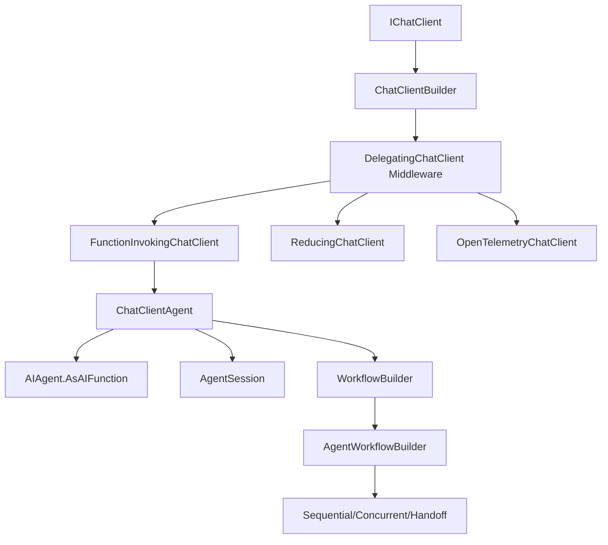

# AGENTS.md

A 20-lesson hands-on guide for Microsoft Agent Framework (MAF) and Microsoft.Extensions.AI in .NET 10 / C#. Each `sNN_*` folder is a standalone runnable chapter.

## Verification commands (run from repo root)

- Build everything: `dotnet build`
- Run a chapter: `dotnet run --project sNN_<topic>` (e.g. `dotnet run --project s03_agent_loop`)
- Run the hosting chapter: `dotnet run --project s19_hosting_observability`
- Web app (docs renderer): `cd web && npm install && npm run dev` (binds :3000)

There is no `dotnet test` project and no linter/formatter is configured. `dotnet build` is the only static check for C#.

## CI reality (important)

CI in `.github/workflows/` builds the .NET solution AND the Next.js `web/` app. Verify locally with `dotnet build` and a smoke run.

## Framework stack

- **Microsoft.Extensions.AI (MEAI)** v10.7.0 — `IChatClient`, `AIFunctionFactory`, `DelegatingChatClient` middleware, chat reducers, evaluation
- **Microsoft Agent Framework (MAF)** v1.10.0 — `ChatClientAgent`, `AIAgent`, `WorkflowBuilder`, `AgentWorkflowBuilder`, A2A protocol, MCP integration
- **OpenAI SDK** — provider implementation via `OpenAIClient.GetChatClient().AsIChatClient()`
- **ModelContextProtocol** v1.4.0 — MCP client/server for external tool integration

## .NET solution layout

`LearnClaudeCode.slnx` has 20 standalone projects (`s01_*` through `s20_*`). Each targets `net10.0`. There is no shared library — each chapter is self-contained and uses MAF/MEAI NuGet packages directly.

`Directory.Build.props` (root) sets `<LangVersion>latest</LangVersion>`, `<Nullable>enable</Nullable>`, `<ImplicitUsings>enable</ImplicitUsings>`. `Directory.Packages.props` (root) manages NuGet versions centrally.

## API key / LLM config

The default engine is **OpenAI-compatible**. Configure via `appsettings.json` or environment variables:
- `baseUrl`: OpenAI-compatible endpoint (default: `https://api.openai.com/v1`)
- `modelId`: Model identifier (default: `gpt-4o-mini`)
- `apiKey`: API key

Key resolution order:
1. `apiKey` in `appsettings.json` (anything other than `PUT-YOUR-KEY-HERE`).
2. `OPENAI_API_KEY` env var.

Per-chapter config: copy `sNN_*/appsettings.example.json` to `sNN_*/appsettings.json` and edit. `appsettings.json` is gitignored at every `s*/` level — never commit it.

## Tutorial tracks

### Foundations (s01–s06)
| # | Chapter | Key Concept |
|---|---------|-------------|
| 01 | `s01_provider_agnostic` | MEAI `IChatClient`, provider switching, streaming |
| 02 | `s02_middleware_pipeline` | `DelegatingChatClient`, custom middleware, pipeline composition |
| 03 | `s03_agent_loop` | MAF `ChatClientAgent`, `AIAgent`, sessions, `RunAsync`/`RunStreamingAsync` |
| 04 | `s04_tool_use` | `AIFunctionFactory.Create()`, `FunctionInvokingChatClient`, tool dispatch |
| 05 | `s05_permission` | `ApprovalRequiredAIFunction`, approval loop, `ToolApprovalRequestContent` |
| 06 | `s06_hooks` | Pre/post tool hooks via `DelegatingChatClient` middleware |

### Agent Features (s07–s12)
| # | Chapter | Key Concept |
|---|---------|-------------|
| 07 | `s07_planning` | Custom `todo_write` tool, state tracking, agent planning |
| 08 | `s08_agent_as_tool` | `AIAgent.AsAIFunction()`, nested agent composition |
| 09 | `s09_skill_loading` | Two-level skill injection, `SKILL.md` catalog, on-demand loading |
| 10 | `s10_context_compaction` | `MessageCountingChatReducer`, `SummarizingChatReducer`, MAF compaction |
| 11 | `s11_system_prompt` | Dynamic system prompt assembly, section-keyed fragments, caching |
| 12 | `s12_error_recovery` | Retry middleware, exponential backoff, max_tokens escalation |

### Orchestration & Integration (s13–s17)
| # | Chapter | Key Concept |
|---|---------|-------------|
| 13 | `s13_workflows` | MAF `WorkflowBuilder`, executors, edges, conditional routing, supersteps |
| 14 | `s14_background_tasks` | `BackgroundService`, async tool execution, notification injection |
| 15 | `s15_multi_agent_workflows` | `AgentWorkflowBuilder.BuildSequential/BuildConcurrent`, `TurnToken` |
| 16 | `s16_a2a_protocol` | A2A protocol, `AgentCard`, agent-to-agent communication |
| 17 | `s17_mcp_integration` | `McpClient`, `McpClientTool`, in-memory MCP server, tool pool merging |

### Production & Capstone (s18–s20)
| # | Chapter | Key Concept |
|---|---------|-------------|
| 18 | `s18_evaluation` | MEAI `CoherenceEvaluator`, `RelevanceEvaluator`, `CompositeEvaluator` |
| 19 | `s19_hosting_observability` | ASP.NET Core hosting, `AddAIAgent()`, OpenTelemetry tracing |
| 20 | `s20_comprehensive` | All mechanisms from s01–s19 wired together |

## Skills folder

`skills/agent-builder/`, `skills/code-review/`, `skills/mcp-builder/`, `skills/pdf/` are Markdown assets consumed by chapter s09 (`s09_skill_loading`). They contain `SKILL.md` files with YAML frontmatter. They are not OpenCode/Cursor skill files.

## Runtime artifacts (auto-created, gitignored)

When agents run, they may create `.memory/`, `.tasks/`, `.mailboxes/`, `.worktrees/`, `logs/` directories. All are in `.gitignore`; safe to delete.

## Key MAF/MEAI patterns

## Entry points (high-signal files)

- Smallest chapter: `s01_provider_agnostic/Program.cs`
- Agent loop: `s03_agent_loop/Program.cs`
- Tool use: `s04_tool_use/Program.cs`
- Workflows: `s13_workflows/Program.cs`
- MCP integration: `s17_mcp_integration/Program.cs`
- Capstone: `s20_comprehensive/Program.cs`
