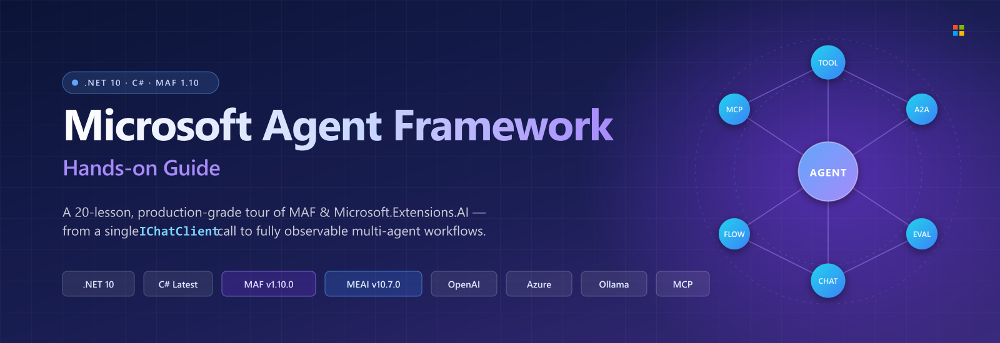
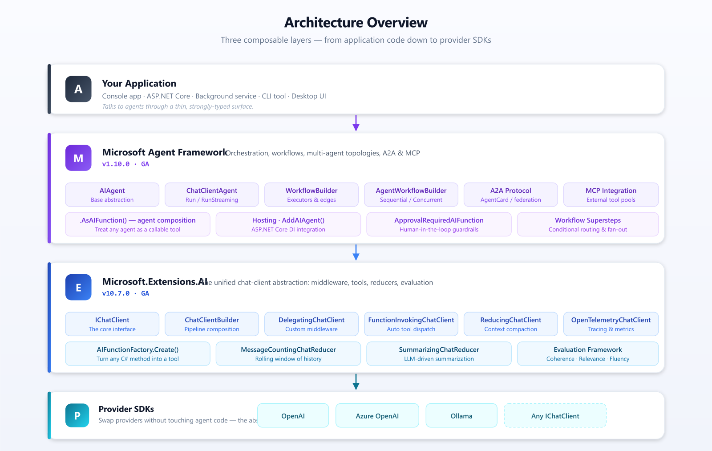
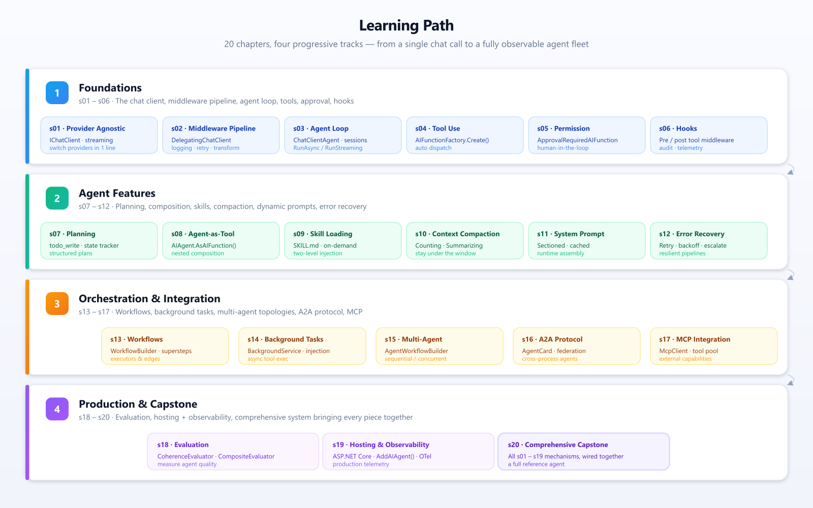

<div align="center">



# Microsoft Agent Framework &nbsp;·&nbsp; Hands-on Guide

**A 20-lesson, production-grade tour of building AI agents in .NET 10 / C#**
*From a single `IChatClient` call to a fully observable, multi-agent fleet.*

[](https://dotnet.microsoft.com/)
[](https://learn.microsoft.com/dotnet/csharp/)
[](https://www.nuget.org/packages/Microsoft.Agents.AI)
[](https://www.nuget.org/packages/Microsoft.Extensions.AI)
[](./LICENSE)
[](https://github.com/yanziyang/learn-Microsoft-Agent-Framework/pulls)

**[English](./README.md)** &nbsp;·&nbsp; [中文](./README-zh.md)

[Quick&nbsp;Start](#quick-start) &nbsp;·&nbsp; [Architecture](#architecture-overview) &nbsp;·&nbsp; [Chapter&nbsp;Map](#chapter-map--20-lessons) &nbsp;·&nbsp; [Learning&nbsp;Path](#learning-path) &nbsp;·&nbsp; [Configuration](#configuration)

</div>

---

> **Why this repo?**
> Microsoft Agent Framework (MAF) and Microsoft.Extensions.AI (MEAI) are the official .NET stack for building production AI agents. This guide unpacks the *whole* surface &mdash; provider-agnostic chat, middleware pipelines, tool calling, human-in-the-loop, workflows, A2A, MCP, evaluation, hosting, telemetry &mdash; through **20 self-contained chapters** you can run, read, and remix in minutes.

Each `sNN_*` folder is a standalone `Program.cs` console app. No shared library, no hidden magic &mdash; just MAF/MEAI NuGet packages, wired together one concept at a time. The default engine is **OpenAI-compatible**, configurable to any provider.

---

## Architecture Overview



**Three composable layers, top to bottom:**

1. **Your Application** &mdash; console, ASP.NET Core, background service, CLI, or desktop UI.
2. **Microsoft Agent Framework (MAF)** &mdash; orchestration, workflows, multi-agent topologies, A2A &amp; MCP.
3. **Microsoft.Extensions.AI (MEAI)** &mdash; the unified `IChatClient` abstraction: middleware, tools, reducers, evaluation.
4. **Provider SDKs** &mdash; OpenAI, Azure OpenAI, Ollama, or any `IChatClient`. Swap without touching agent code.

---

## Quick Start

```bash
# 1. Clone the repo
git clone https://github.com/yanziyang/learn-Microsoft-Agent-Framework.git
cd learn-Microsoft-Agent-Framework

# 2. Configure your API key (once)
cp appsettings.example.json appsettings.json
#    then edit appsettings.json and replace PUT-YOUR-KEY-HERE
#    or just export OPENAI_API_KEY=sk-...

# 3. Build everything
dotnet build

# 4. Run any chapter
dotnet run --project s01_provider_agnostic   # start here: one call, any provider
dotnet run --project s03_agent_loop          # the agent loop itself
dotnet run --project s20_comprehensive       # the capstone: everything wired together
```

> Each chapter is independent &mdash; you can jump straight into `s13_workflows` or `s17_mcp_integration` without doing the earlier ones.

---

## Chapter Map &mdash; 20 Lessons

Four progressive tracks. Pick a row, run the project, read the code.

### Track 1 &middot; Foundations &nbsp;`s01 – s06`

> The chat client, middleware pipeline, agent loop, tools, approval, and hooks.

| # | Chapter | Key Concept | Stack |
|---|---------|-------------|-------|
| 01 | [`s01_provider_agnostic`](./s01_provider_agnostic/) | `IChatClient`, provider switching, streaming | MEAI |
| 02 | [`s02_middleware_pipeline`](./s02_middleware_pipeline/) | `DelegatingChatClient`, custom middleware | MEAI |
| 03 | [`s03_agent_loop`](./s03_agent_loop/) | `ChatClientAgent`, sessions, `RunAsync` / `RunStreamingAsync` | MAF |
| 04 | [`s04_tool_use`](./s04_tool_use/) | `AIFunctionFactory.Create()`, tool dispatch | MEAI |
| 05 | [`s05_permission`](./s05_permission/) | `ApprovalRequiredAIFunction`, approval loop | MAF |
| 06 | [`s06_hooks`](./s06_hooks/) | Pre/post tool hooks via middleware | MEAI |

### Track 2 &middot; Agent Features &nbsp;`s07 – s12`

> Planning, composition, skills, compaction, dynamic prompts, error recovery.

| # | Chapter | Key Concept | Stack |
|---|---------|-------------|-------|
| 07 | [`s07_planning`](./s07_planning/) | Custom `todo_write` tool, state tracking | Custom |
| 08 | [`s08_agent_as_tool`](./s08_agent_as_tool/) | `AIAgent.AsAIFunction()`, nested composition | MAF |
| 09 | [`s09_skill_loading`](./s09_skill_loading/) | Two-level skill injection, `SKILL.md` catalog | Custom |
| 10 | [`s10_context_compaction`](./s10_context_compaction/) | `MessageCountingChatReducer`, `SummarizingChatReducer` | MEAI |
| 11 | [`s11_system_prompt`](./s11_system_prompt/) | Dynamic system prompt assembly, caching | Custom |
| 12 | [`s12_error_recovery`](./s12_error_recovery/) | Retry middleware, exponential backoff | MEAI |

### Track 3 &middot; Orchestration &amp; Integration &nbsp;`s13 – s17`

> Workflows, background tasks, multi-agent topologies, A2A protocol, MCP.

| # | Chapter | Key Concept | Stack |
|---|---------|-------------|-------|
| 13 | [`s13_workflows`](./s13_workflows/) | `WorkflowBuilder`, executors, edges, supersteps | MAF |
| 14 | [`s14_background_tasks`](./s14_background_tasks/) | `BackgroundService`, async execution | .NET |
| 15 | [`s15_multi_agent_workflows`](./s15_multi_agent_workflows/) | `AgentWorkflowBuilder`, sequential / concurrent | MAF |
| 16 | [`s16_a2a_protocol`](./s16_a2a_protocol/) | A2A protocol, `AgentCard` | MAF |
| 17 | [`s17_mcp_integration`](./s17_mcp_integration/) | `McpClient`, `McpClientTool`, in-memory server | MCP |

### Track 4 &middot; Production &amp; Capstone &nbsp;`s18 – s20`

> Evaluation, hosting + observability, and a comprehensive system bringing every piece together.

| # | Chapter | Key Concept | Stack |
|---|---------|-------------|-------|
| 18 | [`s18_evaluation`](./s18_evaluation/) | `CoherenceEvaluator`, `RelevanceEvaluator` | MEAI |
| 19 | [`s19_hosting_observability`](./s19_hosting_observability/) | ASP.NET Core hosting, OpenTelemetry | MAF + OTel |
| 20 | [`s20_comprehensive`](./s20_comprehensive/) | All mechanisms from s01–s19 wired together | All |

---

## Framework Versions

| Package | Version | Status |
|---------|---------|--------|
| `Microsoft.Extensions.AI` | **10.7.0** | GA |
| `Microsoft.Agents.AI` | **1.10.0** | GA |
| `Microsoft.Agents.AI.Workflows` | **1.10.0** | GA |
| `Microsoft.Agents.AI.Hosting` | **1.10.0-preview** | Preview |
| `ModelContextProtocol` | **1.4.0** | GA |

NuGet versions are managed centrally in [`Directory.Packages.props`](./Directory.Packages.props). All projects target `net10.0` and share the same `<LangVersion>latest</LangVersion>`, `<Nullable>enable</Nullable>`, `<ImplicitUsings>enable</ImplicitUsings>` settings via [`Directory.Build.props`](./Directory.Build.props).

---

## Configuration

Every chapter reads from `appsettings.json` or environment variables &mdash; same shape, same resolution order.

```json
{
  "baseUrl": "https://api.openai.com/v1",
  "modelId": "gpt-4o-mini",
  "apiKey":  "PUT-YOUR-KEY-HERE"
}
```

**Key resolution order:**
1. `apiKey` in `appsettings.json` (anything other than `PUT-YOUR-KEY-HERE`)
2. `OPENAI_API_KEY` environment variable

> **Per-chapter override:** copy `sNN_*/appsettings.example.json` to `sNN_*/appsettings.json` and edit. The `appsettings.json` file is gitignored at every `s*/` level &mdash; **never commit it**.

The default engine is OpenAI-compatible, but `baseUrl` lets you point at any OpenAI-compatible endpoint (Azure OpenAI, Ollama, vLLM, llama.cpp server, DeepSeek, etc.).

---

## Project Structure

```text
learn-Microsoft-Agent-Framework/
├── s01_provider_agnostic/      # IChatClient abstraction
├── s02_middleware_pipeline/    # DelegatingChatClient middleware
├── s03_agent_loop/             # ChatClientAgent
├── s04_tool_use/               # AIFunctionFactory
├── s05_permission/             # ApprovalRequiredAIFunction
├── s06_hooks/                  # Middleware hooks
├── s07_planning/               # todo_write tool
├── s08_agent_as_tool/          # Agent composition
├── s09_skill_loading/          # SKILL.md catalog
├── s10_context_compaction/     # Chat reducers
├── s11_system_prompt/          # Dynamic prompts
├── s12_error_recovery/         # Retry middleware
├── s13_workflows/              # MAF workflows
├── s14_background_tasks/       # Background execution
├── s15_multi_agent_workflows/  # Multi-agent orchestration
├── s16_a2a_protocol/           # A2A protocol
├── s17_mcp_integration/        # MCP integration
├── s18_evaluation/             # Quality evaluation
├── s19_hosting_observability/  # ASP.NET Core + OpenTelemetry
├── s20_comprehensive/          # Capstone: everything together
│
├── assets/                     # Hero, architecture, learning-path images
├── skills/                     # SKILL.md assets consumed by s09
├── docs/en/                    # English documentation
├── docs/zh/                    # Chinese documentation
├── web/                        # Next.js documentation site
│
├── Directory.Build.props       # Shared MSBuild properties
├── Directory.Packages.props    # Central NuGet version management
└── LearnClaudeCode.slnx        # Solution file
```

---

## Learning Path



**Suggested route:** start with **Track 1** to internalize `IChatClient`, middleware, and the agent loop. Move through **Track 2** to add planning, composition, and resilience. Use **Track 3** when you need orchestration, multi-agent or external tool servers. Cap off with **Track 4** for evaluation, hosting, and a reference architecture.

> Already comfortable with MEAI? Skim s01-s02 and jump to `s03_agent_loop`. Want a tour first? Run `s20_comprehensive` to see every mechanism light up in a single program.

---

## Verification Commands

There is no `dotnet test` project and no linter is configured &mdash; `dotnet build` is the canonical static check.

```bash
dotnet build                                  # build the full solution
dotnet run --project s03_agent_loop           # run a single chapter
dotnet run --project s19_hosting_observability  # ASP.NET Core hosting + OTel
cd web && npm install && npm run dev           # docs renderer on http://localhost:3000
```

---

## Credits

This project was inspired by and references the following open-source project:

[learn-claude-code](https://github.com/shareAI-lab/learn-claude-code) by [ShareAI Lab](https://github.com/shareAI-lab)

Many thanks to the authors and contributors for sharing their work with the community. This project builds upon ideas, concepts, and/or implementation approaches presented in their repository.

Please refer to the original project for additional documentation, updates, and licensing information.

---

## License

[MIT](./LICENSE) &copy; contributors. PRs welcome &mdash; open an issue if you spot a typo, an outdated API, or a chapter that could use more love.

<div align="center">

**Build agents. Compose middleware. Ship with confidence.**

</div>
