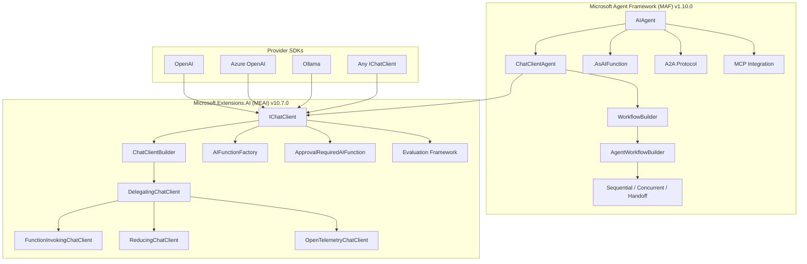

[English](./README.md) | [中文](./README-zh.md)

<a href="https://trendshift.io/repositories/19746" target="_blank"></a>

# Microsoft Agent Framework (MAF) and Microsoft.Extensions.AI Hands-on Guide

> A 20-lesson hands-on tutorial for building AI agents with Microsoft
> Agent Framework (MAF) and Microsoft.Extensions.AI (MEAI) in .NET 10 / C#.
> Each chapter ships as a self-contained `Program.cs` console app using
> MAF/MEAI NuGet packages directly. The default engine is **OpenAI-compatible**
> (configurable to any provider).

## Architecture Overview



## Quick Start

```bash
# 1. Clone and configure
cp appsettings.example.json appsettings.json
# Edit appsettings.json with your API key

# 2. Build everything
dotnet build

# 3. Run any chapter
dotnet run --project s01_provider_agnostic
dotnet run --project s03_agent_loop
dotnet run --project s20_comprehensive
```

## Chapter Map (20 Lessons)

### Foundations (s01–s06)

| # | Chapter | Key Concept | Framework |
|---|---------|-------------|-----------|
| 01 | `s01_provider_agnostic` | `IChatClient`, provider switching, streaming | MEAI |
| 02 | `s02_middleware_pipeline` | `DelegatingChatClient`, custom middleware | MEAI |
| 03 | `s03_agent_loop` | `ChatClientAgent`, sessions, `RunAsync`/`RunStreamingAsync` | MAF |
| 04 | `s04_tool_use` | `AIFunctionFactory.Create()`, tool dispatch | MEAI |
| 05 | `s05_permission` | `ApprovalRequiredAIFunction`, approval loop | MAF |
| 06 | `s06_hooks` | Pre/post tool hooks via middleware | MEAI |

### Agent Features (s07–s12)

| # | Chapter | Key Concept | Framework |
|---|---------|-------------|-----------|
| 07 | `s07_planning` | Custom `todo_write` tool, state tracking | Custom |
| 08 | `s08_agent_as_tool` | `AIAgent.AsAIFunction()`, nested composition | MAF |
| 09 | `s09_skill_loading` | Two-level skill injection, `SKILL.md` catalog | Custom |
| 10 | `s10_context_compaction` | `MessageCountingChatReducer`, `SummarizingChatReducer` | MEAI |
| 11 | `s11_system_prompt` | Dynamic system prompt assembly, caching | Custom |
| 12 | `s12_error_recovery` | Retry middleware, exponential backoff | MEAI |

### Orchestration & Integration (s13–s17)

| # | Chapter | Key Concept | Framework |
|---|---------|-------------|-----------|
| 13 | `s13_workflows` | `WorkflowBuilder`, executors, edges, supersteps | MAF |
| 14 | `s14_background_tasks` | `BackgroundService`, async execution | .NET |
| 15 | `s15_multi_agent_workflows` | `AgentWorkflowBuilder`, sequential/concurrent | MAF |
| 16 | `s16_a2a_protocol` | A2A protocol, `AgentCard` | MAF |
| 17 | `s17_mcp_integration` | `McpClient`, `McpClientTool`, in-memory server | MCP |

### Production & Capstone (s18–s20)

| # | Chapter | Key Concept | Framework |
|---|---------|-------------|-----------|
| 18 | `s18_evaluation` | `CoherenceEvaluator`, `RelevanceEvaluator` | MEAI |
| 19 | `s19_hosting_observability` | ASP.NET Core hosting, OpenTelemetry | MAF + OTel |
| 20 | `s20_comprehensive` | All mechanisms from s01–s19 wired together | All |

## Framework Versions

| Package | Version | Status |
|---------|---------|--------|
| `Microsoft.Extensions.AI` | 10.7.0 | GA |
| `Microsoft.Agents.AI` | 1.10.0 | GA |
| `Microsoft.Agents.AI.Workflows` | 1.10.0 | GA |
| `Microsoft.Agents.AI.Hosting` | 1.10.0-preview | Preview |
| `ModelContextProtocol` | 1.4.0 | GA |

## Configuration

Each chapter reads config from `appsettings.json` or environment variables:

```json
{
  "baseUrl": "https://api.openai.com/v1",
  "modelId": "gpt-4o-mini",
  "apiKey": "PUT-YOUR-KEY-HERE"
}
```

Key resolution order:
1. `apiKey` in `appsettings.json` (anything other than `PUT-YOUR-KEY-HERE`)
2. `OPENAI_API_KEY` environment variable

Per-chapter: copy `sNN_*/appsettings.example.json` to `sNN_*/appsettings.json` and edit.

## Project Structure

```
├── s01_provider_agnostic/     # IChatClient abstraction
├── s02_middleware_pipeline/   # DelegatingChatClient middleware
├── s03_agent_loop/            # ChatClientAgent
├── s04_tool_use/              # AIFunctionFactory
├── s05_permission/            # ApprovalRequiredAIFunction
├── s06_hooks/                 # Middleware hooks
├── s07_planning/              # TodoWrite tool
├── s08_agent_as_tool/         # Agent composition
├── s09_skill_loading/         # Skill loading
├── s10_context_compaction/    # Chat reducers
├── s11_system_prompt/         # Dynamic prompts
├── s12_error_recovery/        # Retry middleware
├── s13_workflows/             # MAF workflows
├── s14_background_tasks/      # Background execution
├── s15_multi_agent_workflows/ # Multi-agent orchestration
├── s16_a2a_protocol/          # A2A protocol
├── s17_mcp_integration/       # MCP integration
├── s18_evaluation/            # Quality evaluation
├── s19_hosting_observability/ # ASP.NET Core + OpenTelemetry
├── s20_comprehensive/         # All features combined
├── skills/                    # SKILL.md assets for s09
├── docs/en/                   # English documentation
├── docs/zh/                   # Chinese documentation
├── web/                       # Next.js documentation site
├── Directory.Build.props      # Shared MSBuild properties
├── Directory.Packages.props   # Central NuGet version management
└── LearnClaudeCode.slnx       # Solution file
```

## Learning Path

```mermaid
graph LR
    A[s01 Provider Agnostic] --> B[s02 Middleware]
    B --> C[s03 Agent Loop]
    C --> D[s04 Tool Use]
    D --> E[s05 Permission]
    E --> F[s06 Hooks]
    F --> G[s07 Planning]
    G --> H[s08 Agent-as-Tool]
    H --> I[s09 Skills]
    I --> J[s10 Compaction]
    J --> K[s11 System Prompt]
    K --> L[s12 Error Recovery]
    L --> M[s13 Workflows]
    M --> N[s14 Background Tasks]
    N --> O[s15 Multi-Agent]
    O --> P[s16 A2A Protocol]
    P --> Q[s17 MCP Integration]
    Q --> R[s18 Evaluation]
    R --> S[s19 Hosting & Observability]
    S --> T[s20 Comprehensive]

    style A fill:#e1f5fe
    style C fill:#e1f5fe
    style M fill:#fff3e0
    style T fill:#e8f5e9
```




