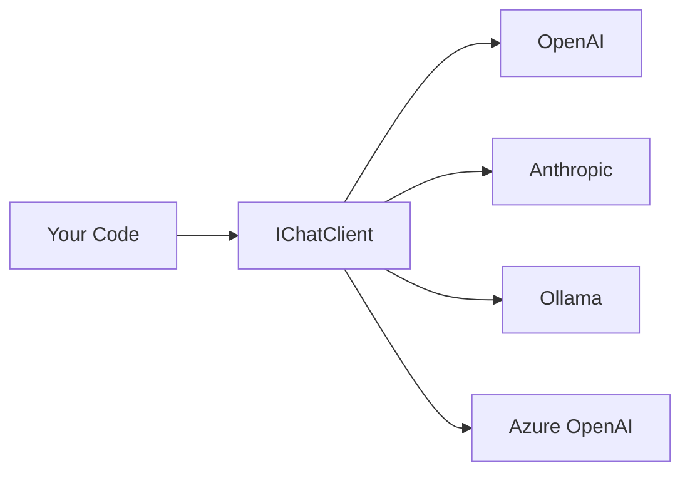

# s01: Provider-Agnostic Chat Client

`[ s01 ] s02 > s03 > s04 > s05 > s06 | s07 > s08 > s09 > s10 > s11 > s12`

> *Swap providers without changing a single line of downstream code.*
>
> **Foundation layer**: `IChatClient` -- the universal abstraction for every LLM.

## Problem

Every LLM provider (OpenAI, Anthropic, Ollama, Azure) has its own SDK with different types, methods, and conventions. Switching providers means rewriting your entire integration layer.

## Solution



`IChatClient` from `Microsoft.Extensions.AI` is the single interface all providers implement. Your code programs against the interface; the provider is a configuration detail.

## How It Works

1. Create an `IChatClient` from any provider SDK:

```csharp
// OpenAI
IChatClient client = new ChatClient(modelId, new ApiKeyCredential(apiKey),
    new OpenAIClientOptions { Endpoint = new Uri(baseUrl) })
    .AsIChatClient();

// Anthropic (swap one line)
IChatClient client = new AnthropicClient(apiKey).Messages.AsIChatClient();

// Ollama (swap one line)
IChatClient client = new OllamaApiClient("http://localhost:11434", "llama3").AsIChatClient();
```

2. Non-streaming call:

```csharp
var response = await client.GetResponseAsync("What is .NET?");
Console.WriteLine(response.Text);
```

3. Streaming call:

```csharp
await foreach (var update in client.GetStreamingResponseAsync("Name three benefits of C#."))
{
    Console.Write(update);
}
```

4. Build a middleware pipeline with `ChatClientBuilder`:

```csharp
var pipeline = client
    .AsBuilder()
    .Use(async (messages, options, next, ct) =>
    {
        Console.WriteLine("[before]");
        await next(messages, options, ct);
        Console.WriteLine("[after]");
    })
    .Build();
```

## Key APIs

| API | Purpose |
|-----|---------|
| `IChatClient` | Core abstraction -- all providers implement this |
| `.AsIChatClient()` | Extension method to convert provider-specific client |
| `GetResponseAsync()` | Non-streaming chat completion |
| `GetStreamingResponseAsync()` | Streaming token-by-token response |
| `ChatClientBuilder` | Fluent builder for middleware pipeline |

## Try It

```sh
dotnet run --project s01_provider_agnostic
```

Prompts to try:
1. `What is .NET? Answer in one sentence.`
2. `Name three benefits of C#.`
3. `Say hello in one word.` (tests middleware pipeline)
