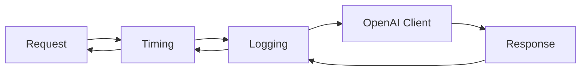

# s02: Middleware Pipeline

`[ s01 ] [ s02 ] s03 > s04 > s05 > s06 | s07 > s08 > s09 > s10 > s11 > s12`

> *Cross-cutting concerns without touching business logic.*
>
> **Pipeline layer**: `DelegatingChatClient` -- wrap any `IChatClient` with interceptors.

## Problem

You need logging, timing, retries, and telemetry around every LLM call. Adding these directly to your code creates tangled, duplicated logic that's hard to maintain.

## Solution



The decorator pattern: each middleware wraps the inner client. Requests flow outward-to-inward, responses flow inward-to-outward.

## How It Works

1. Define middleware by extending `DelegatingChatClient`:

```csharp
class TimingChatClient(IChatClient inner) : DelegatingChatClient(inner)
{
    public override async Task<ChatResponse> GetResponseAsync(
        IEnumerable<ChatMessage> messages, ChatOptions? options = null,
        CancellationToken ct = default)
    {
        var sw = Stopwatch.StartNew();
        var response = await base.GetResponseAsync(messages, options, ct);
        Console.WriteLine($"[timing] {sw.ElapsedMilliseconds}ms");
        return response;
    }
}
```

2. Compose the pipeline with `AsBuilder().Use()`:

```csharp
var client = innerClient
    .AsBuilder()
    .Use(inner => new TimingChatClient(inner))
    .Use(inner => new LoggingChatClient(inner))
    .Build();
```

3. Use the pipeline exactly like a plain `IChatClient`:

```csharp
var response = await client.GetResponseAsync("What is DI?");
```

4. Built-in middleware -- add OpenTelemetry anywhere in the chain:

```csharp
.UseOpenTelemetry()    // MEAI built-in extension
```

## Key APIs

| API | Purpose |
|-----|---------|
| `DelegatingChatClient` | Base class for custom middleware |
| `AsBuilder()` | Creates a `ChatClientBuilder` for fluent pipeline |
| `.Use(inner => new MyMiddleware(inner))` | Adds middleware to the pipeline |
| `.UseOpenTelemetry()` | Built-in OpenTelemetry tracing middleware |
| `base.GetResponseAsync()` | Delegates to the next layer in the pipeline |

## Try It

```sh
dotnet run --project s02_middleware_pipeline
```

Prompts to try:
1. `What is dependency injection? One sentence.`
2. `Name two design patterns in C#.` (streaming -- shows timing)
