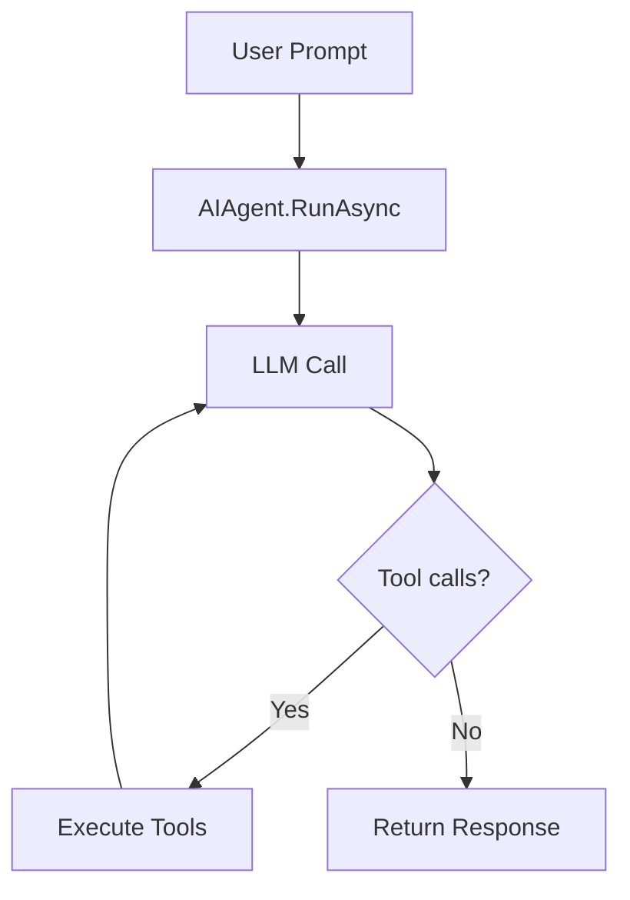

# s03: The Agent Loop

`[ s01 ] [ s02 ] [ s03 ] s04 > s05 > s06 | s07 > s08 > s09 > s10 > s11 > s12`

> *One loop + tools = an agent.*
>
> **Agent layer**: `ChatClientAgent` / `AIAgent` -- managed conversation loops with sessions.

## Problem

A language model can reason, but it can't *act* -- no file I/O, no shell commands, no API calls. Without an agent loop, you manually copy-paste results back to the model.

## Solution



`ChatClientAgent` wraps an `IChatClient` with agent capabilities: system instructions, session state, and a managed conversation loop.

## How It Works

1. Create an `AIAgent` from an `IChatClient`:

```csharp
IChatClient chatClient = new ChatClient(modelId, credential, options).AsIChatClient();

AIAgent agent = chatClient.AsAIAgent(
    instructions: "You are a concise assistant.",
    name: "TutorialAgent");
```

2. Single-turn run:

```csharp
var result = await agent.RunAsync("What is the capital of France?");
Console.WriteLine(result.Text);
```

3. Multi-turn conversation with `AgentSession`:

```csharp
AgentSession session = await agent.CreateSessionAsync();

var r1 = await agent.RunAsync("My name is Alice.", session);
var r2 = await agent.RunAsync("What is my name?", session);
// r2 remembers "Alice" from the session history
```

4. Streaming with `RunStreamingAsync`:

```csharp
await foreach (var update in agent.RunStreamingAsync("Tell me a fact.", session))
{
    Console.Write(update);
}
```

## Key APIs

| API | Purpose |
|-----|---------|
| `IChatClient.AsAIAgent()` | Converts a chat client into an agent |
| `ChatClientAgent` | Low-level agent with explicit config |
| `AIAgent.RunAsync()` | Execute a single agent turn |
| `AIAgent.RunStreamingAsync()` | Streaming agent turn |
| `AgentSession` | Preserves conversation history across turns |

## Try It

```sh
dotnet run --project s03_agent_loop
```

Prompts to try:
1. `What is the capital of France?` (single turn)
2. `My name is Alice.` then `What is my name?` (multi-turn memory)
3. `Tell me a fun fact about C#.` (streaming)
