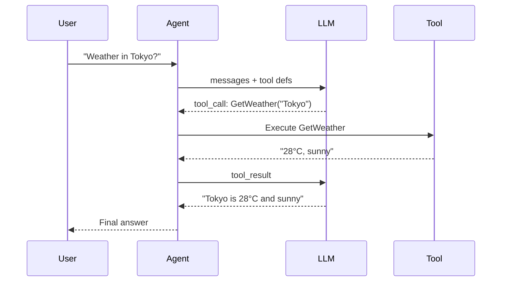

# s04: Tool Use

`[ s01 ] [ s02 ] [ s03 ] [ s04 ] s05 > s06 | s07 > s08 > s09 > s10 > s11 > s12`

> *Give your agent hands.*
>
> **Tool layer**: `AIFunctionFactory` + `FunctionInvokingChatClient` -- register any C# method as a tool.

## Problem

An agent without tools can only talk. It needs to call APIs, query databases, run calculations, and execute shell commands to be useful.

## Solution



## How It Works

1. Define tools as plain C# methods with `[Description]` attributes:

```csharp
[Description("Get the current weather for a location")]
static string GetWeather([Description("City name")] string city) =>
    city.ToLower() switch {
        "london" => "London: 15°C, cloudy",
        "tokyo" => "Tokyo: 28°C, sunny",
        _ => $"{city}: 22°C, partly cloudy"
    };
```

2. Register tools via `AIFunctionFactory.Create()`:

```csharp
var tools = new List<AITool>
{
    AIFunctionFactory.Create(GetWeather),
    AIFunctionFactory.Create(GetCurrentTime),
    AIFunctionFactory.Create(Calculate),
};
```

3. Wrap the client with `FunctionInvokingChatClient` for automatic tool dispatch:

```csharp
var chatClient = new FunctionInvokingChatClient(client);
```

4. Create the agent with tools:

```csharp
var agent = new ChatClientAgent(chatClient,
    instructions: "Use tools to answer questions.",
    tools: tools);
```

5. The LLM decides which tools to call -- the framework executes them automatically.

## Key APIs

| API | Purpose |
|-----|---------|
| `AIFunctionFactory.Create()` | Converts a C# method into an `AITool` |
| `FunctionInvokingChatClient` | Middleware that auto-dispatches tool calls |
| `AITool` | Base type for all tools |
| `[Description]` | Describes tool/parameter purpose to the LLM |
| `ChatClientAgent` | Agent that receives tools in its constructor |

## Try It

```sh
dotnet run --project s04_tool_use
```

Prompts to try:
1. `What's the weather in Tokyo and London?` (multi-tool)
2. `What time is it now?`
3. `Calculate 42 * 17 + 3`
