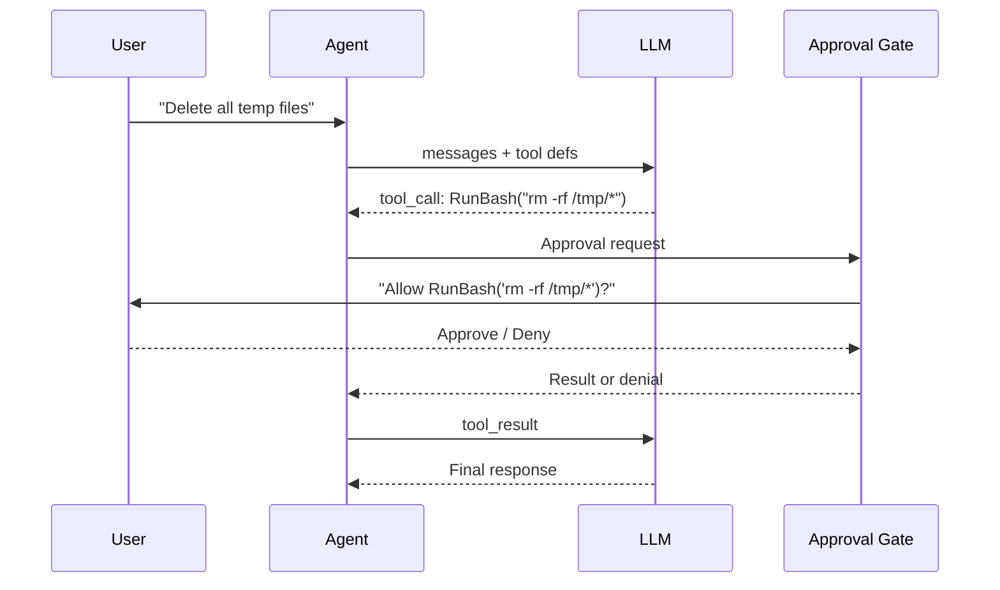

# s05: Tool Permission & Approval

`[ s01 ] [ s02 ] [ s03 ] [ s04 ] [ s05 ] s06 | s07 > s08 > s09 > s10 > s11 > s12`

> *Not every tool should run without asking.*
>
> **Safety layer**: `ApprovalRequiredAIFunction` -- gate dangerous tools behind human approval.

## Problem

Agents with shell access or file-write capabilities can cause damage if the LLM hallucinates a destructive command. You need a human-in-the-loop gate for sensitive operations.

## Solution



## How It Works

1. Wrap sensitive tools with `ApprovalRequiredAIFunction`:

```csharp
var tools = new List<AITool>
{
    AIFunctionFactory.Create(GetWeather),           // safe -- no approval needed
    new ApprovalRequiredAIFunction(                  // gated -- requires approval
        AIFunctionFactory.Create(RunBash)),
};
```

2. The framework intercepts tool calls and emits `ToolApprovalRequestContent`:

```csharp
// When the LLM calls RunBash, the framework pauses and asks for approval.
// The approval flow is handled by the agent framework automatically.
```

3. Build a pipeline with `FunctionInvokingChatClient`:

```csharp
var client = new FunctionInvokingChatClient(baseClient);
var agent = new ChatClientAgent(client,
    instructions: "Use tools. Some require approval.",
    tools: tools);
```

4. Safe tools execute immediately; gated tools wait for approval.

## Key APIs

| API | Purpose |
|-----|---------|
| `ApprovalRequiredAIFunction` | Wraps an `AITool` to require human approval |
| `ToolApprovalRequestContent` | Content type emitted when approval is needed |
| `AITool` | The underlying tool being gated |
| `FunctionInvokingChatClient` | Dispatches tool calls through the approval flow |

## Try It

```sh
dotnet run --project s05_permission
```

Prompts to try:
1. `What's the weather?` (no approval needed)
2. `Run the command: ls -la` (triggers approval)
3. `Delete all files in /tmp` (triggers approval -- deny this!)
