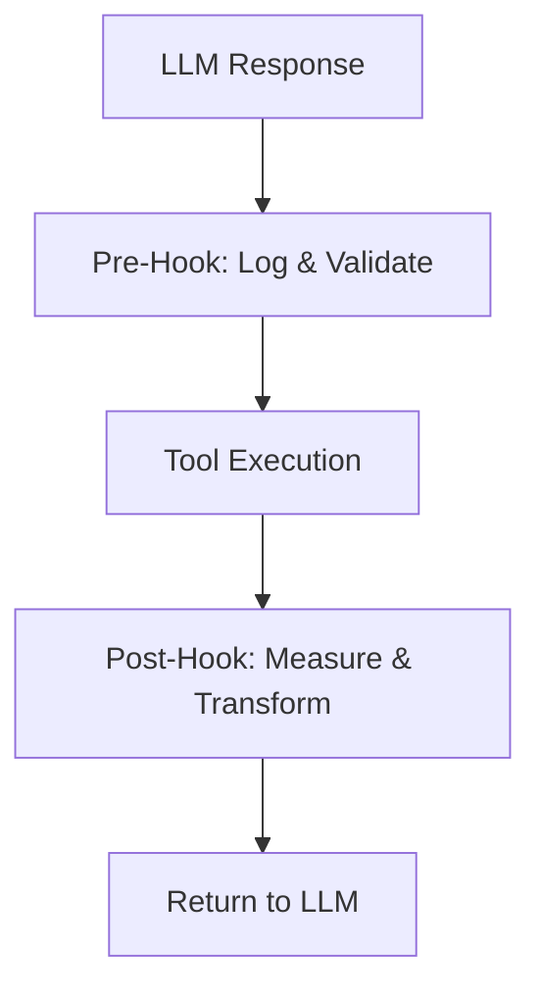

# s06: Pre/Post Tool Hooks

`[ s01 ] [ s02 ] [ s03 ] [ s04 ] [ s05 ] [ s06 ] | s07 > s08 > s09 > s10 > s11 > s12`

> *Observe and modify tool behavior without changing the tools themselves.*
>
> **Observability layer**: `DelegatingChatClient` middleware for tool lifecycle events.

## Problem

You need to log every tool call, measure execution time, validate inputs, or transform outputs -- but you don't want to modify each tool's source code.

## Solution



Use `DelegatingChatClient` middleware to intercept the full request/response cycle, including tool invocations handled by `FunctionInvokingChatClient`.

## How It Works

1. Create an audit middleware that wraps `GetResponseAsync`:

```csharp
sealed class AuditMiddleware(IChatClient inner) : DelegatingChatClient(inner)
{
    public override async Task<ChatResponse> GetResponseAsync(
        IEnumerable<ChatMessage> messages, ChatOptions? options = null,
        CancellationToken ct = default)
    {
        var lastUser = messages.LastOrDefault(m => m.Role == ChatRole.User)?.Text ?? "";
        Console.WriteLine($"[AUDIT] → {lastUser[..Math.Min(60, lastUser.Length)]}");

        var sw = Stopwatch.StartNew();
        var response = await base.GetResponseAsync(messages, options, ct);
        sw.Stop();

        Console.WriteLine($"[AUDIT] ← {response.Text?.Length} chars in {sw.ElapsedMilliseconds}ms");
        return response;
    }
}
```

2. Insert the middleware in the pipeline (outside `FunctionInvokingChatClient`):

```csharp
var client = baseClient
    .AsBuilder()
    .Use(inner => new AuditMiddleware(inner))
    .UseFunctionInvocation()
    .Build();
```

3. Every call -- including tool-triggered re-prompt loops -- passes through the hook.

## Key APIs

| API | Purpose |
|-----|---------|
| `DelegatingChatClient` | Base class for intercepting middleware |
| `.Use(inner => new Hook(inner))` | Registers middleware in the pipeline |
| `messages.LastOrDefault(m => m.Role == ChatRole.User)` | Inspect conversation content |
| `response.FinishReason` | Check if LLM stopped or called tools |
| `Stopwatch` | Measure tool/LLM execution time |

## Try It

```sh
dotnet run --project s06_hooks
```

Prompts to try:
1. `What is 2+2?` (observe audit log)
2. `What's the weather in London?` (observe tool call logging)
