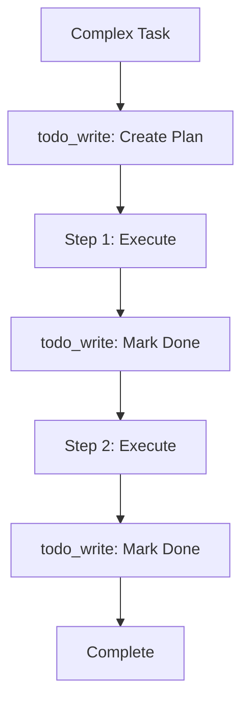

# s07: Agent Planning with TodoWrite

`[ s01 ] s02 > s03 > s04 > s05 > s06 | [ s07 ] s08 > s09 > s10 > s11 > s12`

> *Break complex tasks into tracked steps.*
>
> **Planning layer**: Custom `todo_write` tool for stateful task tracking.

## Problem

Complex tasks require multi-step planning. Without structured state, agents lose track of what's done, what's pending, and what comes next.

## Solution



A custom `todo_write` tool lets the agent maintain a structured task list that persists across conversation turns.

## How It Works

1. Define the todo state and tool:

```csharp
var todoState = new List<(string content, string status)>();

[Description("Add a todo item")]
static string TodoWrite(
    [Description("List of todos as content|status lines")] string items,
    List<(string, string)> state)
{
    state.Clear();
    foreach (var line in items.Split('\n', StringSplitOptions.RemoveEmptyEntries))
    {
        var parts = line.Split('|', 2);
        state.Add((parts[0].Trim(), parts.Length > 1 ? parts[1].Trim() : "pending"));
    }
    return $"Updated: {state.Count} items";
}
```

2. Register as a tool via `AIFunctionFactory`:

```csharp
var todoTool = AIFunctionFactory.Create(
    (string items) => TodoWrite(items, todoState),
    name: "todo_write",
    description: "Manage a todo list. Format: one 'content|status' per line.");
tools.Add(todoTool);
```

3. The agent uses `todo_write` to plan and track progress:

```
User: "Refactor the auth module and add tests"
Agent calls: todo_write("Refactor auth service|pending\nWrite unit tests|pending\nRun tests|pending")
Agent calls: todo_write("Refactor auth service|done\nWrite unit tests|pending\nRun tests|pending")
```

## Key APIs

| API | Purpose |
|-----|---------|
| `AIFunctionFactory.Create()` | Register the todo tool |
| `todo_write` | Custom tool name the LLM calls |
| Closure capture | Share `todoState` between tool and main code |
| `[Description]` | Tells the LLM the expected format |

## Try It

```sh
dotnet run --project s07_planning
```

Prompts to try:
1. `Create a plan to build a hello-world web app`
2. `Mark the first task as done and add a new task for deployment`
