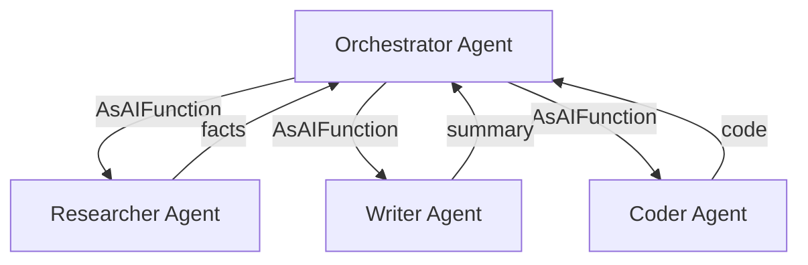

# s08: Agent as Tool (Composition)

`[ s01 ] s02 > s03 > s04 > s05 > s06 | s07 > [ s08 ] s09 > s10 > s11 > s12`

> *Specialist agents as callable tools for a orchestrator agent.*
>
> **Composition layer**: `AIAgent.AsAIFunction()` -- delegate sub-tasks to specialist agents.

## Problem

A single agent trying to do everything becomes a "jack of all trades, master of none." You need specialized agents for research, writing, coding, etc., coordinated by an orchestrator.

## Solution



Each specialist is a full `AIAgent` exposed as a single tool via `.AsAIFunction()`.

## How It Works

1. Create specialist agents:

```csharp
AIAgent researcher = client.AsAIAgent(
    instructions: "Research topics concisely. Return key facts only.",
    name: "Researcher",
    description: "Researches topics and returns facts");

AIAgent writer = client.AsAIAgent(
    instructions: "Write clear summaries from research notes.",
    name: "Writer",
    description: "Writes summaries from notes");
```

2. Expose them as tools:

```csharp
var tools = new List<AITool>
{
    researcher.AsAIFunction(),
    writer.AsAIFunction(),
};
```

3. Create the orchestrator with specialist tools:

```csharp
var orchestrator = new ChatClientAgent(client,
    instructions: "Delegate research to Researcher, writing to Writer.",
    name: "Orchestrator",
    tools: tools);
```

4. The orchestrator decides when to call each specialist:

```csharp
var result = await orchestrator.RunAsync("Research quantum computing and write a summary.");
// Orchestrator calls Researcher, then Writer, then synthesizes the final answer
```

## Key APIs

| API | Purpose |
|-----|---------|
| `AIAgent.AsAIFunction()` | Wraps an agent as a callable tool |
| `ChatClientAgent` | Create agents with specific instructions |
| `instructions` | Define the specialist's role and behavior |
| `description` | Tells the orchestrator when to use this tool |

## Try It

```sh
dotnet run --project s08_agent_as_tool
```

Prompts to try:
1. `Research the history of C# and write a one-paragraph summary`
2. `What are the top 3 web frameworks? Research and compare them.`
