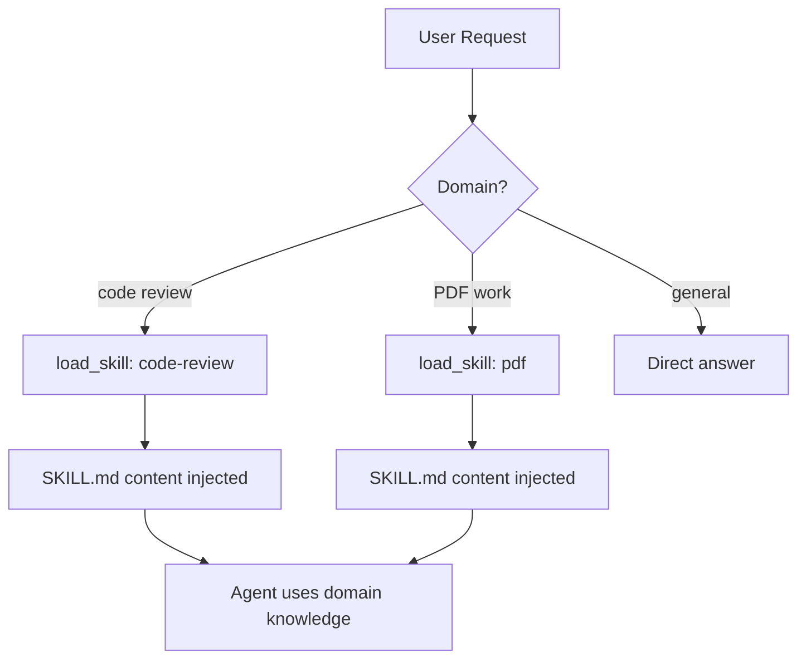

# s09: Skill Loading

`[ s01 ] s02 > s03 > s04 > s05 > s06 | s07 > s08 > [ s09 ] s10 > s11 > s12`

> *Domain expertise on demand.*
>
> **Knowledge layer**: `SKILL.md` catalog + `load_skill` tool for on-demand instruction loading.

## Problem

System prompts can't contain instructions for every possible domain. You need a way to inject specialized knowledge (code review rules, PDF generation steps, MCP patterns) only when needed.

## Solution



Skills are Markdown files in `skills/` with YAML frontmatter. The `load_skill` tool reads them on demand.

## How It Works

1. Skill files follow this structure:

```markdown
---
name: code-review
description: Code review checklist and patterns
---
# Code Review Skill
## Checklist
- [ ] Naming conventions
- [ ] Error handling
...
```

2. Build a skill catalog from the filesystem:

```csharp
var skillsDir = Path.GetFullPath("skills");
var skillCatalog = new Dictionary<string, string>();
foreach (var dir in Directory.GetDirectories(skillsDir))
{
    var skillFile = Path.Combine(dir, "SKILL.md");
    if (File.Exists(skillFile))
        skillCatalog[Path.GetFileName(dir)] = skillFile;
}
```

3. Register the `load_skill` tool:

```csharp
var loadSkill = AIFunctionFactory.Create(
    (string name) =>
    {
        if (skillCatalog.TryGetValue(name, out var path))
            return File.ReadAllText(path);
        return $"Skill '{name}' not found. Available: {string.Join(", ", skillCatalog.Keys)}";
    },
    name: "load_skill",
    description: "Load a skill by name for detailed instructions.");
```

4. Two-level loading: agent catalogs first, then loads details on demand.

## Key APIs

| API | Purpose |
|-----|---------|
| `SKILL.md` | Markdown skill definition with YAML frontmatter |
| `load_skill` | Custom tool to load skill content |
| `AIFunctionFactory.Create()` | Register the loader as a tool |
| `skills/` directory | Skill catalog location |

## Try It

```sh
dotnet run --project s09_skill_loading
```

Prompts to try:
1. `Load the code-review skill and review this function: int Add(int a, int b) => a + b;`
2. `What skills are available?` (lists catalog)
