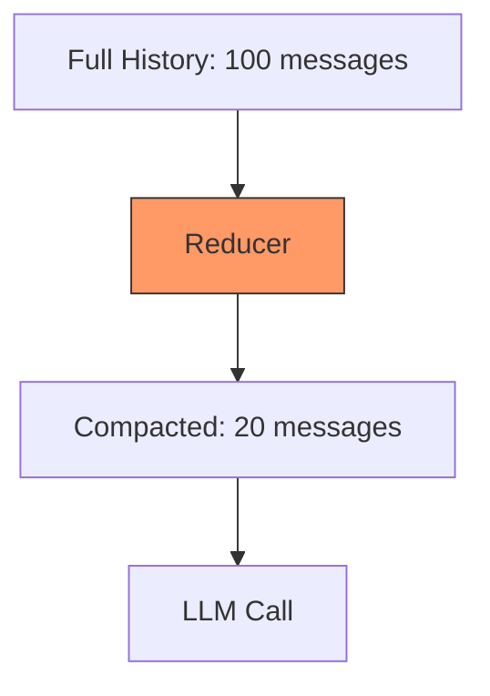

# s10: Context Compaction

`[ s01 ] s02 > s03 > s04 > s05 > s06 | s07 > s08 > s09 > [ s10 ] s11 > s12`

> *Keep conversations within token limits.*
>
> **Memory layer**: `MessageCountingChatReducer` + `SummarizingChatReducer` for automatic history management.

## Problem

Long conversations exceed the model's context window. Messages get truncated or the call fails entirely. You need automatic history management.

## Solution



Reducers sit in the middleware pipeline and automatically trim or summarize message history before it reaches the LLM.

## How It Works

1. Message-counting reducer -- keeps the last N messages:

```csharp
var client = baseClient
    .AsBuilder()
    .UseChatReducer(new MessageCountingChatReducer(50))
    .UseFunctionInvocation()
    .Build();
```

2. Summarizing reducer -- replaces old messages with a summary:

```csharp
var client = baseClient
    .AsBuilder()
    .UseChatReducer(new SummarizingChatReducer(innerClient, maxMessages: 30))
    .UseFunctionInvocation()
    .Build();
```

3. The reducer runs automatically before each LLM call:

```
Turn 1: [msg1] → LLM
Turn 5: [msg1..msg5] → LLM
Turn 50: [msg1..msg50] → Reducer → [summary + msg41..msg50] → LLM
```

4. Combine reducers with other middleware:

```csharp
var client = baseClient.AsBuilder()
    .Use(inner => new AuditMiddleware(inner))
    .UseChatReducer(new MessageCountingChatReducer(50))
    .UseFunctionInvocation()
    .Build();
```

## Key APIs

| API | Purpose |
|-----|---------|
| `MessageCountingChatReducer` | Keeps the last N messages, drops older ones |
| `SummarizingChatReducer` | Summarizes old messages using the LLM |
| `.UseChatReducer()` | Extension method to add a reducer to the pipeline |
| `DelegatingChatClient` | Reducers are middleware under the hood |

## Try It

```sh
dotnet run --project s10_context_compaction
```

Prompts to try:
1. Have a long conversation (10+ turns) and observe compaction in logs
2. Ask the agent to recall something from early in the conversation
