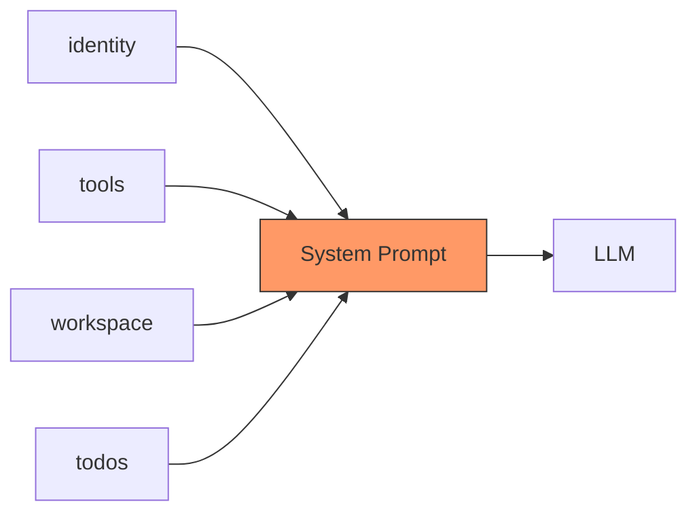

# s11: Dynamic System Prompt

`[ s01 ] s02 > s03 > s04 > s05 > s06 | s07 > s08 > s09 > s10 > [ s11 ] s12`

> *Assemble system prompts from modular sections.*
>
> **Prompt layer**: Section-keyed fragments with caching for efficient assembly.

## Problem

System prompts need to include dynamic context: available tools, current directory, active todos, user preferences. Hardcoding everything into one string is brittle and wasteful.

## Solution



Build the system prompt from named sections. Cache it and invalidate only when context changes.

## How It Works

1. Define sections in a dictionary:

```csharp
var sections = new Dictionary<string, string>
{
    ["identity"] = "You are a comprehensive coding assistant.",
    ["tools"] = $"Available tools: {string.Join(", ", tools.Select(t => t.Name))}",
    ["workspace"] = $"Working directory: {Directory.GetCurrentDirectory()}",
};
```

2. Add dynamic sections (e.g., todo state):

```csharp
string? cachedPrompt = null;
string GetPrompt()
{
    if (cachedPrompt is not null) return cachedPrompt;
    cachedPrompt = string.Join("\n\n", sections.Values);
    if (todoState.Count > 0)
        cachedPrompt += "\n\nCurrent todos:\n" + string.Join("\n",
            todoState.Select(t => $"- [{t.status}] {t.content}"));
    return cachedPrompt;
}
```

3. Invalidate cache when context changes:

```csharp
// After modifying todos:
cachedPrompt = null;  // force rebuild on next call
```

4. Use in the agent's instructions or as a middleware-injected system message.

## Key APIs

| API | Purpose |
|-----|---------|
| `Dictionary<string, string>` | Section-keyed prompt fragments |
| `string.Join()` | Assemble sections into full prompt |
| Cache pattern | Avoid rebuilding prompt every call |
| `instructions` parameter | Pass the assembled prompt to the agent |

## Try It

```sh
dotnet run --project s11_system_prompt
```

Prompts to try:
1. `What tools do you have?` (tests tool section)
2. `What directory are you in?` (tests workspace section)
3. `Add a todo: fix the login bug` (tests dynamic section update)
