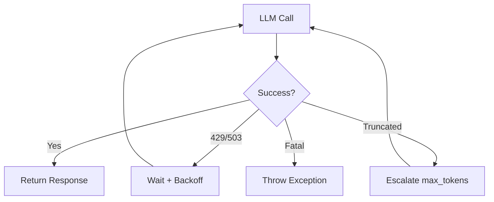

# s12: Error Recovery & Retry

`[ s01 ] s02 > s03 > s04 > s05 > s06 | s07 > s08 > s09 > s10 > s11 > [ s12 ]`

> *Graceful handling of transient failures.*
>
> **Resilience layer**: Retry middleware with exponential backoff and token escalation.

## Problem

LLM APIs return 429 (rate limit), 503 (overloaded), or the response gets truncated (`FinishReason == Length`). Without retry logic, these transient errors crash your agent.

## Solution



## How It Works

1. Retry middleware with exponential backoff:

```csharp
sealed class RetryMiddleware(IChatClient inner) : DelegatingChatClient(inner)
{
    public int MaxRetries { get; set; } = 3;
    public int BaseDelayMs { get; set; } = 500;

    public override async Task<ChatResponse> GetResponseAsync(
        IEnumerable<ChatMessage> messages, ChatOptions? options = null,
        CancellationToken ct = default)
    {
        for (int attempt = 0; attempt < MaxRetries; attempt++)
        {
            try
            {
                var response = await base.GetResponseAsync(messages, options, ct);
                if (response.FinishReason == ChatFinishReason.Length && MaxTokens < 32768)
                {
                    MaxTokens = Math.Min(MaxTokens * 4, 32768);
                    options = options?.Clone() ?? new ChatOptions();
                    options.MaxOutputTokens = MaxTokens;
                    return await base.GetResponseAsync(messages, options, ct);
                }
                return response;
            }
            catch (Exception ex) when (IsTransient(ex))
            {
                var delay = BaseDelayMs * Math.Pow(2, attempt) + Random.Shared.Next(0, 250);
                await Task.Delay((int)delay, ct);
            }
        }
        throw new Exception("Max retries exceeded");
    }

    static bool IsTransient(Exception ex) =>
        ex.Message.Contains("429") || ex.Message.Contains("529") || ex.Message.Contains("503");
}
```

2. Insert in the pipeline:

```csharp
var client = baseClient.AsBuilder()
    .Use(inner => new RetryMiddleware(inner))
    .UseFunctionInvocation()
    .Build();
```

## Key APIs

| API | Purpose |
|-----|---------|
| `DelegatingChatClient` | Base class for retry middleware |
| `ChatFinishReason.Length` | Detect truncated responses |
| `options.MaxOutputTokens` | Escalate token limit on truncation |
| `Task.Delay()` + exponential backoff | Rate limit recovery |
| `IsTransient()` | Classify retryable errors |

## Try It

```sh
dotnet run --project s12_error_recovery
```

Prompts to try:
1. `Write a very long essay about .NET history` (may trigger token escalation)
2. Normal queries (observe retry behavior if rate-limited)
