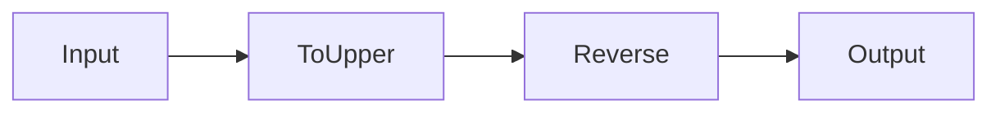

# s13: Workflows

`[ s01 ] s02 > s03 > s04 > s05 > s06 | s07 > s08 > s09 > s10 > s11 > s12 | [ s13 ] s14 > s15 > s16 > s17`

> *Orchestrate multi-step data flows as graphs.*
>
> **Workflow layer**: `WorkflowBuilder` -- define executors, edges, and conditional routing.

## Problem

Some tasks aren't simple prompt-response. You need data pipelines: transform → validate → store → notify. Hardcoding these as sequential function calls loses flexibility.

## Solution



`WorkflowBuilder` lets you define directed graphs of executors connected by edges.

## How It Works

1. Define executors from functions:

```csharp
Func<string, string> toUpper = s => s.ToUpperInvariant();
var upperExecutor = toUpper.BindAsExecutor("ToUpper");
```

2. Or create custom executor classes:

```csharp
sealed class ReverseExecutor() : Executor<string, string>("Reverse")
{
    public override ValueTask<string> HandleAsync(
        string message, IWorkflowContext context, CancellationToken ct = default)
        => ValueTask.FromResult(string.Concat(message.Reverse()));
}
```

3. Build the workflow graph:

```csharp
var workflow = new WorkflowBuilder(upperExecutor)
    .AddEdge(upperExecutor, reverse)
    .WithOutputFrom(reverse)
    .Build();
```

4. Execute with streaming events:

```csharp
await using var run = await InProcessExecution.RunStreamingAsync(workflow, "Hello, World!");
await foreach (var evt in run.WatchStreamAsync())
{
    if (evt is ExecutorCompletedEvent completed)
        Console.WriteLine($"{completed.ExecutorId}: {completed.Data}");
}
```

5. Fan-out -- one input to multiple executors:

```csharp
var fanOut = new WorkflowBuilder(upperExecutor)
    .AddEdge(upperExecutor, lowerEx)
    .WithOutputFrom(upperExecutor, lowerEx)
    .Build();
```

## Key APIs

| API | Purpose |
|-----|---------|
| `WorkflowBuilder` | Fluent builder for workflow graphs |
| `.BindAsExecutor()` | Convert a `Func<TIn,TOut>` to an executor |
| `Executor<TIn, TOut>` | Base class for custom executors |
| `.AddEdge()` | Connect two executors |
| `.WithOutputFrom()` | Mark terminal executors |
| `InProcessExecution.RunStreamingAsync()` | Execute and stream events |

## Try It

```sh
dotnet run --project s13_workflows
```

Watch the pipeline execute: `ToUpper → Reverse`, then `Trim → Upper → Duplicate`, then fan-out.
