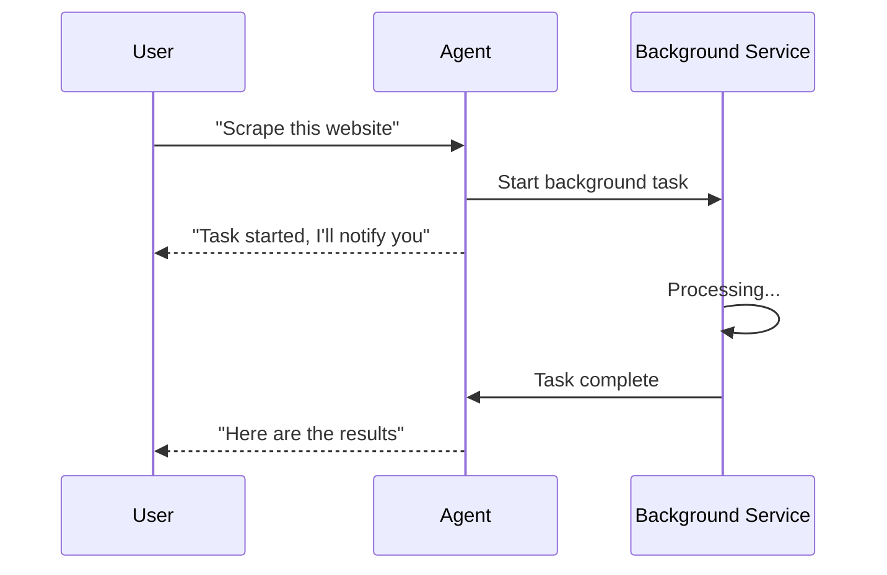

# s14: Background Tasks

`[ s01 ] s02 > s03 > s04 > s05 > s06 | s07 > s08 > s09 > s10 > s11 > s12 | s13 > [ s14 ] s15 > s16 > s17`

> *Run long operations without blocking the agent.*
>
> **Async layer**: `BackgroundService` for non-blocking tool execution.

## Problem

Some tools take minutes (web scraping, large file processing, API polling). Blocking the agent loop during these operations wastes time and frustrates users.

## Solution



Use .NET's `BackgroundService` pattern to run long operations asynchronously, with results injected back into the conversation.

## How It Works

1. Define a background task tool:

```csharp
[Description("Start a long-running background task")]
static string StartBackgroundTask([Description("Task description")] string task)
{
    // Returns immediately -- actual work happens in BackgroundService
    return $"Task '{task}' started. You'll be notified when complete.";
}
```

2. Implement the background service:

```csharp
sealed class TaskRunner : BackgroundService
{
    protected override async Task ExecuteAsync(CancellationToken ct)
    {
        while (!ct.IsCancellationRequested)
        {
            // Poll for pending tasks, execute them, inject results
            await Task.Delay(1000, ct);
        }
    }
}
```

3. Results are injected as system messages into the agent's conversation.

## Key APIs

| API | Purpose |
|-----|---------|
| `BackgroundService` | .NET base class for long-running background work |
| `ExecuteAsync()` | The background loop |
| `CancellationToken` | Graceful shutdown support |
| System message injection | Push results back to the agent |

## Try It

```sh
dotnet run --project s14_background_tasks
```

Prompts to try:
1. `Start a background task to count to 100`
2. `What background tasks are running?`
