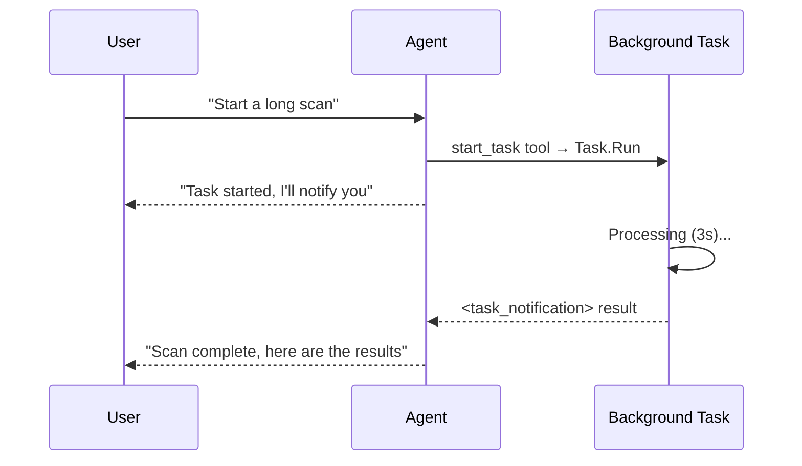

# s14: Background Tasks

`[ s01 ] s02 > s03 > s04 > s05 > s06 | s07 > s08 > s09 > s10 > s11 > s12 | s13 > [ s14 ] s15 > s16 > s17`

> *Run long operations without blocking the agent.*
>
> **Async layer**: `AIFunctionFactory` tools + `<task_notification>` injection.

## Problem

Some tools take minutes (web scraping, large file processing, API polling). Blocking the agent loop during these operations wastes time and frustrates users.

## Solution



Register `AIFunctionFactory` tools that start `Task.Run` work and return immediately. When tasks complete, inject results as `<task_notification>` user messages into the next agent turn.

## How It Works

1. Define background-task tools via `AIFunctionFactory`:

```csharp
var backgroundTasks = new ConcurrentDictionary<string, Task<string>>();

var tools = new List<AITool>
{
    AIFunctionFactory.Create(
        (string command) => {
            var id = $"bg_{Guid.NewGuid().ToString()[..8]}";
            backgroundTasks[id] = Task.Run(async () => {
                await Task.Delay(3000);
                return $"Completed: {command}";
            });
            return $"Started background task {id}";
        },
        name: "start_task",
        description: "Start a long-running background task."),
    AIFunctionFactory.Create(
        (string taskId) => backgroundTasks.TryGetValue(taskId, out var t)
            ? (t.IsCompletedSuccessfully ? $"Done: {t.Result}" : "running")
            : "not found",
        name: "check_task",
        description: "Check task status."),
};
```

2. Create a `ChatClientAgent` with these tools:

```csharp
var agent = new ChatClientAgent(chatClient,
    instructions: "You can start background tasks. " +
                  "When tasks complete, you'll receive a <task_notification>.",
    name: "background-agent",
    tools: tools);
```

3. After tasks complete, inject results as user messages:

```csharp
var completed = backgroundTasks
    .Where(kv => kv.Value.IsCompletedSuccessfully)
    .Select(kv => $"<task_notification id=\"{kv.Key}\">{kv.Value.Result}</task_notification>");

var notification = new ChatMessage(ChatRole.User,
    $"{string.Join("\n", completed)}\nAll tasks complete. Summarize results.");
await agent.RunAsync(notification, session);
```

## Key APIs

| API | Purpose |
|-----|---------|
| `AIFunctionFactory.Create()` | Register background-task tools |
| `ChatClientAgent` | Agent with tool dispatch |
| `ConcurrentDictionary<string, Task<T>>` | Track running background work |
| `<task_notification>` injection | Push completed results back into the conversation |
| `AgentRunOptions.AllowBackgroundResponses` | MAF native background responses (OpenAI Responses API only) |

## Try It

```sh
dotnet run --project s14_background_tasks
```

The demo starts two background tasks, waits for completion, injects `<task_notification>` messages, and asks the agent to summarize.
