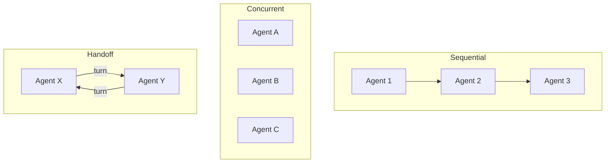

# s15: Multi-Agent Workflows

`[ s01 ] s02 > s03 > s04 > s05 > s06 | s07 > s08 > s09 > s10 > s11 > s12 | s13 > s14 > [ s15 ] s16 > s17`

> *Coordinate multiple agents with structured workflows.*
>
> **Orchestration layer**: `AgentWorkflowBuilder` -- sequential, concurrent, and handoff patterns.

## Problem

Complex tasks require multiple agents working together: one researches, one writes, one reviews. Ad-hoc coordination is error-prone and hard to reason about.

## Solution



`AgentWorkflowBuilder` provides three patterns: sequential (pipeline), concurrent (fan-out), and handoff (turn-based delegation).

## How It Works

1. Sequential -- agents run in order, each getting the previous output:

```csharp
var workflow = AgentWorkflowBuilder.BuildSequential(researcher, writer, reviewer);
```

2. Concurrent -- agents run in parallel on the same input:

```csharp
var workflow = AgentWorkflowBuilder.BuildConcurrent(agent1, agent2, agent3);
```

3. Handoff -- agents pass control to each other via `TurnToken`:

```csharp
// Agent decides to hand off to another agent
yield return new TurnToken(targetAgent: "Writer");
```

4. Execute the workflow:

```csharp
var result = await workflow.RunAsync("Research and summarize .NET 10 features");
```

## Key APIs

| API | Purpose |
|-----|---------|
| `AgentWorkflowBuilder.BuildSequential()` | Pipeline: agent 1 → agent 2 → agent 3 |
| `AgentWorkflowBuilder.BuildConcurrent()` | Fan-out: same input to all agents |
| `TurnToken` | Signal to hand off control to another agent |
| `AIAgent` | Individual agents in the workflow |

## Try It

```sh
dotnet run --project s15_multi_agent_workflows
```

Prompts to try:
1. `Research C# 13 features and write a summary` (sequential)
2. `Compare three approaches to dependency injection` (concurrent)
