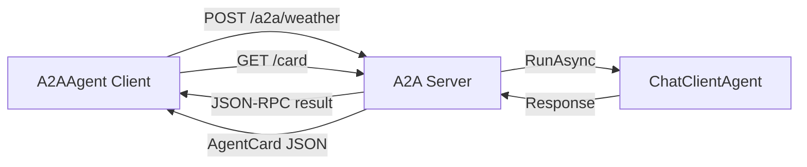

# s16: Agent-to-Agent (A2A) Protocol

`[ s01 ] s02 > s03 > s04 > s05 > s06 | s07 > s08 > s09 > s10 > s11 > s12 | s13 > s14 > s15 > [ s16 ] s17`

> *Standardized agent communication across services.*
>
> **Protocol layer**: `A2AAgent`, `AgentCard`, `AddA2AServer`, `MapA2AHttpJson`.

## Problem

Agents running in different services or organizations need a standard way to discover capabilities and exchange messages. Ad-hoc APIs create integration nightmares.

## Solution



MAF ships dedicated A2A packages: `Microsoft.Agents.AI.A2A` (client) and `Microsoft.Agents.AI.Hosting.A2A.AspNetCore` (server). The server exposes an agent via A2A HTTP+JSON endpoints; the client wraps a remote agent as a local `AIAgent`.

## How It Works

1. **Server side** — register an agent and attach an A2A server:

```csharp
builder.AddAIAgent("weather-agent",
    instructions: "You are a weather assistant.",
    chatClient: chatClient);
builder.AddA2AServer("weather-agent");
```

2. Map A2A HTTP+JSON endpoints:

```csharp
app.MapA2AHttpJson("weather-agent", "/a2a/weather");
```

3. Define an `AgentCard` describing the agent's capabilities:

```csharp
var card = new AgentCard
{
    Name = "WeatherAgent",
    Description = "Provides weather information",
    Version = "1.0",
    Capabilities = new A2A.AgentCapabilities { Streaming = true },
    Skills = [new A2A.AgentSkill { Id = "weather-lookup", Name = "weather-lookup",
        Description = "Get current weather", Tags = ["weather"] }],
};
```

4. **Client side** — create an `A2AAgent` and call it like any `AIAgent`:

```csharp
IA2AClient a2aClient = new A2AClient(
    new Uri("http://localhost:5161/a2a/weather"), new HttpClient());

AIAgent remoteAgent = a2aClient.AsAIAgent(
    name: "RemoteWeatherAgent",
    description: "Calls the weather agent via A2A");

var response = await remoteAgent.RunAsync("What is the weather in London?");
```

5. `A2AAgent` IS-A `AIAgent` — compose it as a tool, place it in a workflow, or use it in any MAF orchestration.

## Protocol Anatomy

```
Client                          Server
  │                               │
  │── GET /a2a/weather/card ────→│  (discover AgentCard)
  │←────── AgentCard JSON ───────│
  │                               │
  │── POST /a2a/weather ────────→│  (JSON-RPC: message/send)
  │                               │  → agent.RunAsync(...)
  │←──── JSON-RPC result ────────│
  │                               │
  Streaming: message/stream → SSE
```

## Key APIs

| API | Package | Purpose |
|-----|---------|---------|
| `A2AClient` | `A2A` | Client for A2A protocol communication |
| `IA2AClient.AsAIAgent()` | `Microsoft.Agents.AI.A2A` | Wrap a remote agent as a local `AIAgent` |
| `AgentCard` | `A2A` | Published metadata: name, capabilities, skills |
| `AddA2AServer()` | `Microsoft.Agents.AI.Hosting.A2A` | Register an A2A server for an agent |
| `MapA2AHttpJson()` | `Microsoft.Agents.AI.Hosting.A2A.AspNetCore` | Map A2A HTTP+JSON endpoints |

## Try It

```sh
dotnet run --project s16_a2a_protocol
```

The demo hosts a weather agent via A2A, then calls it through an `A2AAgent` client — demonstrating both server and client sides of the protocol.
