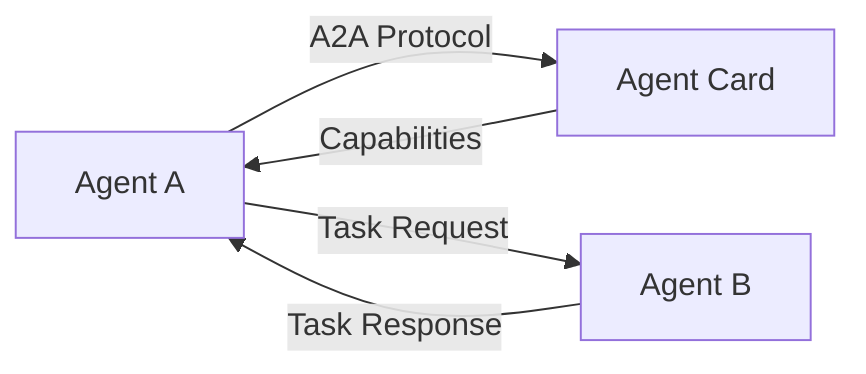

# s16: Agent-to-Agent (A2A) Protocol

`[ s01 ] s02 > s03 > s04 > s05 > s06 | s07 > s08 > s09 > s10 > s11 > s12 | s13 > s14 > s15 > [ s16 ] s17`

> *Standardized agent communication across services.*
>
> **Protocol layer**: A2A `AgentCard` -- discover and communicate with remote agents.

## Problem

Agents running in different services or organizations need a standard way to discover capabilities and exchange messages. Ad-hoc APIs create integration nightmares.

## Solution



The A2A protocol defines a standard for agent discovery (`AgentCard`) and task exchange.

## How It Works

1. Define an `AgentCard` that describes your agent:

```csharp
var agentCard = new AgentCard
{
    Name = "ResearchAgent",
    Description = "Researches topics and returns structured findings",
    Url = "https://api.example.com/agents/research",
    Capabilities = new[] { "research", "summarize" }
};
```

2. Agents discover each other via their cards:

```csharp
// Client discovers a remote agent
var remoteCard = await A2AClient.DiscoverAsync("https://api.example.com/.well-known/agent.json");
```

3. Send tasks to remote agents:

```csharp
var result = await A2AClient.SendTaskAsync(remoteCard.Url, new A2ATask
{
    Message = "Research quantum computing trends"
});
```

4. The protocol handles serialization, capability negotiation, and response routing.

## Key APIs

| API | Purpose |
|-----|---------|
| `AgentCard` | Describes an agent's identity and capabilities |
| `A2AClient.DiscoverAsync()` | Find remote agents via well-known URLs |
| `A2AClient.SendTaskAsync()` | Send a task to a remote agent |
| A2A Protocol | Standardized inter-agent communication |

## Try It

```sh
dotnet run --project s16_a2a_protocol
```

Prompts to try:
1. `Discover available agents`
2. `Send a research task to the remote agent`
