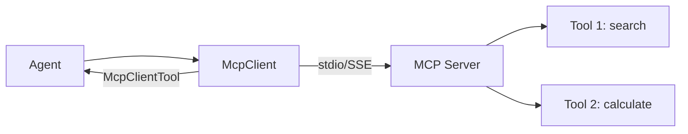

# s17: MCP Integration

`[ s01 ] s02 > s03 > s04 > s05 > s06 | s07 > s08 > s09 > s10 > s11 > s12 | s13 > s14 > s15 > s16 > [ s17 ]`

> *Connect to external tool servers via Model Context Protocol.*
>
> **Integration layer**: `McpClient` + `McpClientTool` -- discover and use MCP server tools.

## Problem

You want to use tools from external servers (databases, APIs, file systems) without hardcoding their implementations. Each server has its own protocol and tool schema.

## Solution



`McpClient` connects to MCP servers, discovers their tools, and returns `McpClientTool` instances that are `IS-A AIFunction` -- no conversion needed.

## How It Works

1. Create an in-memory MCP server with tools:

```csharp
var searchTool = McpServerTool.Create(
    (string query) => $"Search results for '{query}': Found 3 docs.",
    new() { Name = "search_docs", Description = "Search documentation" });

var server = McpServer.Create(
    new StreamServerTransport(reader, writer),
    new McpServerOptions { ToolCollection = [searchTool] });
```

2. Connect a client and discover tools:

```csharp
var mcpClient = await McpClient.CreateAsync(
    new StreamClientTransport(writer, reader));

var mcpTools = await mcpClient.ListToolsAsync();
```

3. Merge MCP tools with built-in tools:

```csharp
var allTools = new List<AITool>(builtInTools);
foreach (var t in mcpTools) allTools.Add(t);
// McpClientTool IS-A AIFunction -- no conversion needed
```

4. Create an agent with the unified tool pool:

```csharp
AIAgent agent = chatClient.AsAIAgent(
    instructions: "Use search_docs for queries and GetWeather for weather.",
    tools: allTools);
```

## Key APIs

| API | Purpose |
|-----|---------|
| `McpClient` | Connects to MCP servers |
| `McpClient.ListToolsAsync()` | Discovers available tools |
| `McpClientTool` | Tool instance (IS-A `AIFunction`) |
| `McpServerTool.Create()` | Define server-side tools |
| `McpServer` | Hosts tools over stdio or SSE transport |

## Try It

```sh
dotnet run --project s17_mcp_integration
```

Prompts to try:
1. `Search for .NET documentation` (MCP tool)
2. `What's the weather in Tokyo?` (built-in tool)
3. `Search for C# docs and tell me the weather in London` (both)
