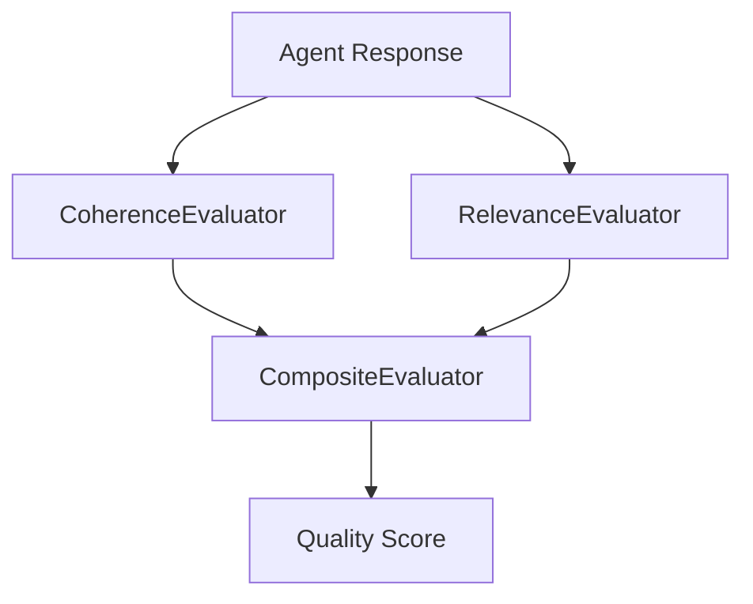

# s18: Evaluation

`[ s01 ] s02 > s03 > s04 > s05 > s06 | s07 > s08 > s09 > s10 > s11 > s12 | s13 > s14 > s15 > s16 > s17 | [ s18 ] s19 > s20`

> *Measure response quality automatically.*
>
> **Quality layer**: `CoherenceEvaluator`, `RelevanceEvaluator`, `CompositeEvaluator`.

## Problem

How do you know if your agent gives good answers? Manual review doesn't scale. You need automated evaluation of response quality.

## Solution



MEAI provides built-in evaluators that score responses on coherence, relevance, and more. Combine them with `CompositeEvaluator`.

## How It Works

1. Evaluate coherence -- does the response make sense?

```csharp
var coherence = new CoherenceEvaluator();
var score = await coherence.EvaluateAsync(prompt, response);
Console.WriteLine($"Coherence: {score.Value}");
```

2. Evaluate relevance -- does the response address the question?

```csharp
var relevance = new RelevanceEvaluator();
var score = await relevance.EvaluateAsync(prompt, response);
Console.WriteLine($"Relevance: {score.Value}");
```

3. Combine evaluators:

```csharp
var evaluator = new CompositeEvaluator(coherence, relevance);
var scores = await evaluator.EvaluateAsync(prompt, response);
```

4. Use in CI/CD pipelines to gate agent quality.

## Key APIs

| API | Purpose |
|-----|---------|
| `CoherenceEvaluator` | Scores logical consistency |
| `RelevanceEvaluator` | Scores topical relevance |
| `CompositeEvaluator` | Combines multiple evaluators |
| `EvaluateAsync()` | Run evaluation on a prompt-response pair |

## Try It

```sh
dotnet run --project s18_evaluation
```

The project runs evaluation on sample prompt-response pairs and prints scores.
