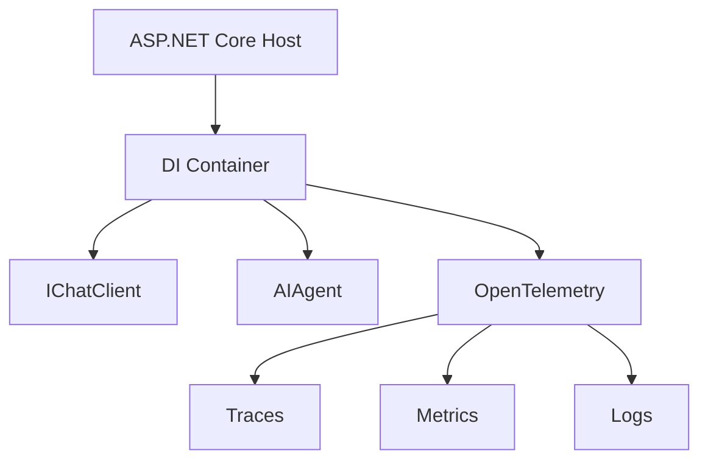

# s19: Hosting & Observability

`[ s01 ] s02 > s03 > s04 > s05 > s06 | s07 > s08 > s09 > s10 > s11 > s12 | s13 > s14 > s15 > s16 > s17 | s18 > [ s19 ] s20`

> *Run agents as services with full telemetry.*
>
> **Production layer**: ASP.NET Core hosting, `AddAIAgent()`, OpenTelemetry tracing.

## Problem

Agents running in `Main()` work for demos but not production. You need health checks, structured logging, distributed tracing, and graceful shutdown.

## Solution



Host your agent in ASP.NET Core for dependency injection, middleware, health checks, and OpenTelemetry out of the box.

## How It Works

1. Register services in `Program.cs`:

```csharp
var builder = WebApplication.CreateBuilder(args);

// Register IChatClient
builder.Services.AddSingleton<IChatClient>(sp =>
    new OpenAIClient(new ApiKeyCredential(apiKey), new OpenAIClientOptions { Endpoint = new Uri(baseUrl) })
        .GetChatClient(modelId).AsIChatClient());

// Register agent
builder.Services.AddAIAgent<ChatClientAgent>(options =>
{
    options.Instructions = "You are a production agent.";
    options.Tools = [AIFunctionFactory.Create(GetWeather)];
});

// Add OpenTelemetry
builder.Services.AddOpenTelemetry()
    .WithTracing(b => b.AddSource("Microsoft.Extensions.AI"))
    .WithMetrics(b => b.AddMeter("Microsoft.Extensions.AI"));
```

2. Use the agent in endpoints:

```csharp
app.MapPost("/chat", async (AIAgent agent, string message) =>
{
    var result = await agent.RunAsync(message);
    return result.Text;
});
```

3. Health checks and graceful shutdown come free with the host.

## Key APIs

| API | Purpose |
|-----|---------|
| `AddAIAgent<T>()` | Register an agent in DI |
| `WebApplication.CreateBuilder()` | ASP.NET Core host builder |
| `AddOpenTelemetry()` | Tracing, metrics, logging |
| `IChatClient` registration | Singleton in DI container |
| `CancellationToken` | Graceful shutdown propagation |

## Try It

```sh
dotnet run --project s19_hosting_observability
```

Then:
1. `curl -X POST http://localhost:5000/chat -d "What's the weather?"`
2. Check OpenTelemetry traces in your collector
