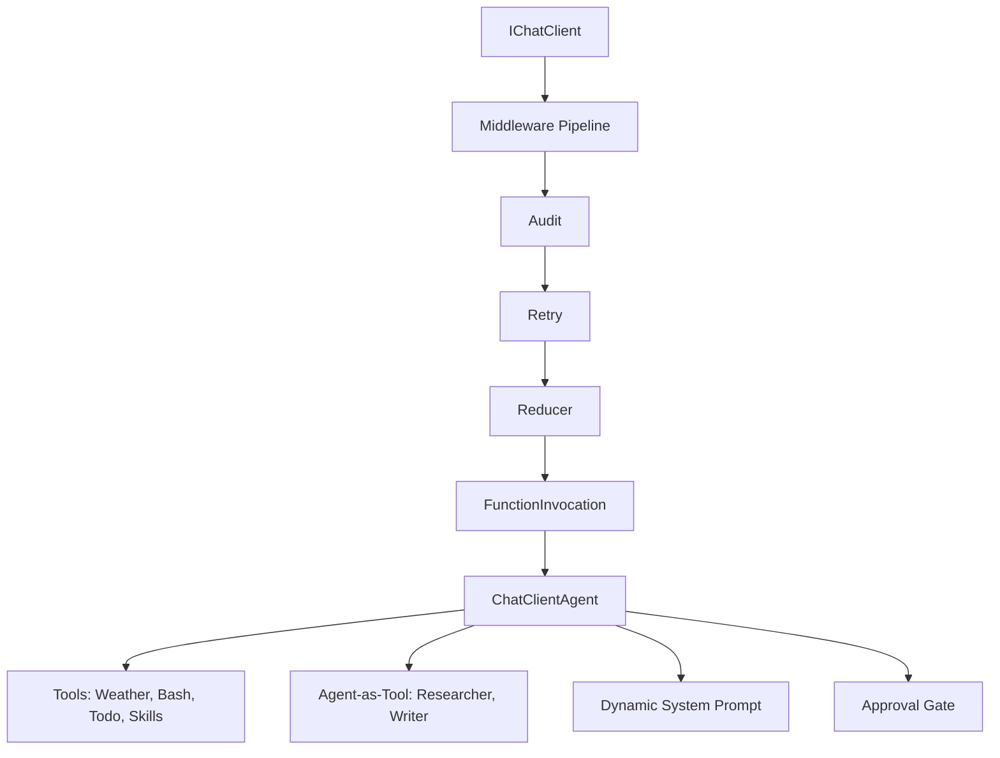

# s20: Comprehensive Capstone

`[ s01 ] s02 > s03 > s04 > s05 > s06 | s07 > s08 > s09 > s10 > s11 > s12 | s13 > s14 > s15 > s16 > s17 | s18 > s19 > [ s20 ]`

> *Everything wired together.*
>
> **Capstone**: All 19 chapters' mechanisms combined into one production-grade agent.

## Problem

Each chapter teaches one concept in isolation. Real agents need all of them working together: middleware, tools, approval, planning, skills, composition, error recovery, and observability.

## Solution



## How It Works

The capstone combines:

| Feature | From Chapter | Implementation |
|---------|-------------|----------------|
| Provider-agnostic client | s01 | `IChatClient` via OpenAI SDK |
| Middleware pipeline | s02 | `AuditMiddleware`, `RetryMiddleware` |
| Agent loop | s03 | `ChatClientAgent` with `RunAsync` |
| Tool use | s04 | `AIFunctionFactory.Create()` |
| Approval gates | s05 | `ApprovalRequiredAIFunction` |
| Pre/post hooks | s06 | `AuditMiddleware` logging |
| Planning | s07 | `todo_write` custom tool |
| Agent composition | s08 | `researcher.AsAIFunction()` |
| Skill loading | s09 | `load_skill` tool |
| Context compaction | s10 | `MessageCountingChatReducer` |
| Dynamic prompts | s11 | Section-keyed assembly + caching |
| Error recovery | s12 | `RetryMiddleware` with backoff |
| System prompt | s11 | `GetPrompt()` with sections |

1. Pipeline assembly:

```csharp
var client = baseClient.AsBuilder()
    .Use(inner => new AuditMiddleware(inner))
    .Use(inner => new RetryMiddleware(inner))
    .UseChatReducer(new MessageCountingChatReducer(50))
    .UseFunctionInvocation()
    .Build();
```

2. All tools registered:

```csharp
var tools = new List<AITool>
{
    AIFunctionFactory.Create(GetWeather),
    new ApprovalRequiredAIFunction(AIFunctionFactory.Create(RunBash)),
    todoTool,
    loadSkill,
    researcher.AsAIFunction(),
    writer.AsAIFunction(),
};
```

3. Interactive REPL with everything active.

## Key APIs

| API | Source |
|-----|--------|
| `IChatClient` | s01 |
| `DelegatingChatClient` | s02 |
| `ChatClientAgent` | s03 |
| `AIFunctionFactory` | s04 |
| `ApprovalRequiredAIFunction` | s05 |
| `MessageCountingChatReducer` | s10 |
| `RetryMiddleware` | s12 |

## Try It

```sh
dotnet run --project s20_comprehensive
```

Prompts to try:
1. `What's the weather in Tokyo?` (tool + audit)
2. `Run the command: echo hello` (approval gate)
3. `Plan and research .NET 10 features` (todo + agent-as-tool)
4. `Load the code-review skill` (skill loading)
