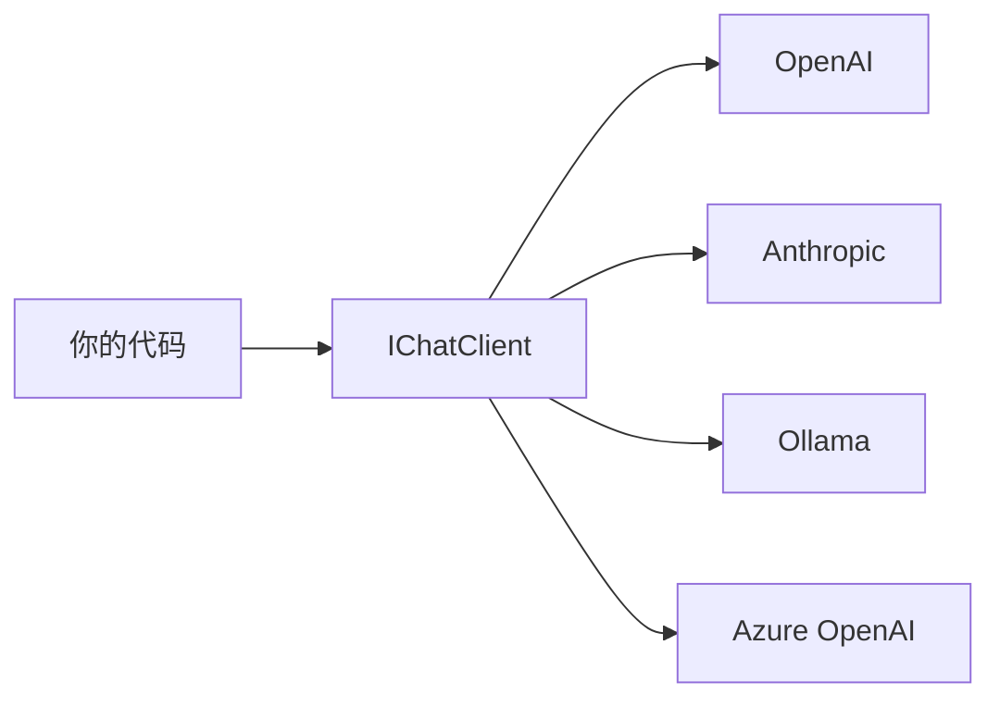

# s01: Provider-Agnostic Chat Client (Provider 无关的 Chat Client)

`[ s01 ] s02 > s03 > s04 > s05 > s06 | s07 > s08 > s09 > s10 > s11 > s12`

> *换 Provider 不改一行代码。*
>
> **基础层**: `IChatClient` -- 所有 LLM 的通用抽象。

## 问题

每个 LLM Provider (OpenAI、Anthropic、Ollama、Azure) 都有自己的 SDK, 类型、方法、约定各不相同。切换 Provider 意味着重写整个集成层。

## 解决方案



`Microsoft.Extensions.AI` 中的 `IChatClient` 是所有 Provider 实现的统一接口。你的代码面向接口编程; Provider 只是配置细节。

## 工作原理

1. 从任意 Provider SDK 创建 `IChatClient`:

```csharp
// OpenAI
IChatClient client = new ChatClient(modelId, new ApiKeyCredential(apiKey),
    new OpenAIClientOptions { Endpoint = new Uri(baseUrl) })
    .AsIChatClient();

// Anthropic (换一行)
IChatClient client = new AnthropicClient(apiKey).Messages.AsIChatClient();

// Ollama (换一行)
IChatClient client = new OllamaApiClient("http://localhost:11434", "llama3").AsIChatClient();
```

2. 非流式调用:

```csharp
var response = await client.GetResponseAsync("什么是 .NET?");
Console.WriteLine(response.Text);
```

3. 流式调用:

```csharp
await foreach (var update in client.GetStreamingResponseAsync("列举 C# 的三个优点."))
{
    Console.Write(update);
}
```

4. 用 `ChatClientBuilder` 构建中间件管道:

```csharp
var pipeline = client
    .AsBuilder()
    .Use(async (messages, options, next, ct) =>
    {
        Console.WriteLine("[before]");
        await next(messages, options, ct);
        Console.WriteLine("[after]");
    })
    .Build();
```

## 关键 API

| API | 用途 |
|-----|------|
| `IChatClient` | 核心抽象 -- 所有 Provider 实现此接口 |
| `.AsIChatClient()` | 扩展方法, 将 Provider 专用客户端转为 `IChatClient` |
| `GetResponseAsync()` | 非流式聊天补全 |
| `GetStreamingResponseAsync()` | 流式逐 token 响应 |
| `ChatClientBuilder` | 中间件管道的流式构建器 |

## 试一试

```sh
dotnet run --project s01_provider_agnostic
```

试试这些 prompt:
1. `What is .NET? Answer in one sentence.`
2. `Name three benefits of C#.`
3. `Say hello in one word.` (测试中间件管道)
