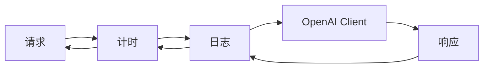

# s02: Middleware Pipeline (中间件管道)

`[ s01 ] [ s02 ] s03 > s04 > s05 > s06 | s07 > s08 > s09 > s10 > s11 > s12`

> *横切关注点, 不碰业务逻辑。*
>
> **管道层**: `DelegatingChatClient` -- 用拦截器包装任意 `IChatClient`。

## 问题

你需要在每次 LLM 调用前后加日志、计时、重试、遥测。直接在代码里加这些会导致逻辑纠缠、代码重复、难以维护。

## 解决方案



装饰器模式: 每个中间件包装内部客户端。请求从外到内, 响应从内到外。

## 工作原理

1. 继承 `DelegatingChatClient` 定义中间件:

```csharp
class TimingChatClient(IChatClient inner) : DelegatingChatClient(inner)
{
    public override async Task<ChatResponse> GetResponseAsync(
        IEnumerable<ChatMessage> messages, ChatOptions? options = null,
        CancellationToken ct = default)
    {
        var sw = Stopwatch.StartNew();
        var response = await base.GetResponseAsync(messages, options, ct);
        Console.WriteLine($"[timing] {sw.ElapsedMilliseconds}ms");
        return response;
    }
}
```

2. 用 `AsBuilder().Use()` 组合管道:

```csharp
var client = innerClient
    .AsBuilder()
    .Use(inner => new TimingChatClient(inner))
    .Use(inner => new LoggingChatClient(inner))
    .Build();
```

3. 像普通 `IChatClient` 一样使用:

```csharp
var response = await client.GetResponseAsync("什么是 DI?");
```

4. 内置中间件 -- 在链中任意位置加 OpenTelemetry:

```csharp
.UseOpenTelemetry()    // MEAI 内置扩展
```

## 关键 API

| API | 用途 |
|-----|------|
| `DelegatingChatClient` | 自定义中间件基类 |
| `AsBuilder()` | 创建 `ChatClientBuilder` 用于流式管道构建 |
| `.Use(inner => new MyMiddleware(inner))` | 向管道添加中间件 |
| `.UseOpenTelemetry()` | 内置 OpenTelemetry 追踪中间件 |
| `base.GetResponseAsync()` | 委托给管道中的下一层 |

## 试一试

```sh
dotnet run --project s02_middleware_pipeline
```

试试这些 prompt:
1. `What is dependency injection? One sentence.`
2. `Name two design patterns in C#.` (流式 -- 可见计时)
