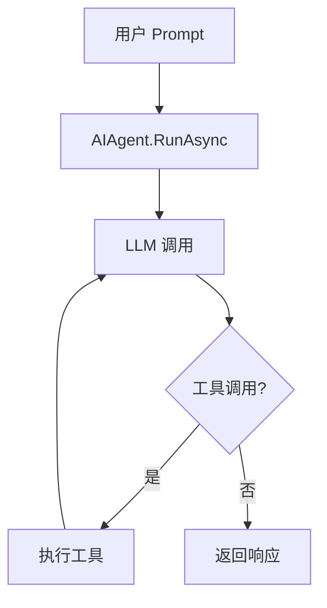

# s03: The Agent Loop (Agent 循环)

`[ s01 ] [ s02 ] [ s03 ] s04 > s05 > s06 | s07 > s08 > s09 > s10 > s11 > s12`

> *一个循环 + 工具 = 一个 Agent。*
>
> **Agent 层**: `ChatClientAgent` / `AIAgent` -- 带会话管理的对话循环。

## 问题

语言模型能推理, 但碰不到真实世界 -- 不能读文件、跑测试、看报错。没有 Agent 循环, 你得手动把结果粘回去。

## 解决方案



`ChatClientAgent` 用 Agent 能力包装 `IChatClient`: 系统指令、会话状态、托管的对话循环。

## 工作原理

1. 从 `IChatClient` 创建 `AIAgent`:

```csharp
IChatClient chatClient = new ChatClient(modelId, credential, options).AsIChatClient();

AIAgent agent = chatClient.AsAIAgent(
    instructions: "你是一个简洁的助手.",
    name: "TutorialAgent");
```

2. 单轮运行:

```csharp
var result = await agent.RunAsync("法国的首都是哪里?");
Console.WriteLine(result.Text);
```

3. 多轮对话, 使用 `AgentSession`:

```csharp
AgentSession session = await agent.CreateSessionAsync();

var r1 = await agent.RunAsync("我叫 Alice.", session);
var r2 = await agent.RunAsync("我叫什么名字?", session);
// r2 从会话历史中记住 "Alice"
```

4. 流式输出 `RunStreamingAsync`:

```csharp
await foreach (var update in agent.RunStreamingAsync("讲个关于 C# 的趣事.", session))
{
    Console.Write(update);
}
```

## 关键 API

| API | 用途 |
|-----|------|
| `IChatClient.AsAIAgent()` | 将 Chat Client 转为 Agent |
| `ChatClientAgent` | 底层 Agent, 需显式配置 |
| `AIAgent.RunAsync()` | 执行单轮 Agent |
| `AIAgent.RunStreamingAsync()` | 流式 Agent 轮次 |
| `AgentSession` | 跨轮次保持对话历史 |

## 试一试

```sh
dotnet run --project s03_agent_loop
```

试试这些 prompt:
1. `What is the capital of France?` (单轮)
2. `My name is Alice.` 然后 `What is my name?` (多轮记忆)
3. `Tell me a fun fact about C#.` (流式)
