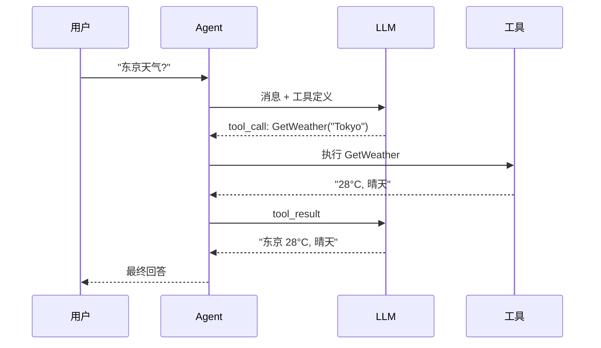

# s04: Tool Use (工具使用)

`[ s01 ] [ s02 ] [ s03 ] [ s04 ] s05 > s06 | s07 > s08 > s09 > s10 > s11 > s12`

> *给你的 Agent 一双手。*
>
> **工具层**: `AIFunctionFactory` + `FunctionInvokingChatClient` -- 把任意 C# 方法注册为工具。

## 问题

没有工具的 Agent 只能说话。它需要调用 API、查数据库、做计算、执行 shell 命令才有用。

## 解决方案



## 工作原理

1. 用 `[Description]` 特性定义工具方法:

```csharp
[Description("获取指定城市的天气")]
static string GetWeather([Description("城市名")] string city) =>
    city.ToLower() switch {
        "london" => "伦敦: 15°C, 多云",
        "tokyo" => "东京: 28°C, 晴天",
        _ => $"{city}: 22°C, 多云"
    };
```

2. 通过 `AIFunctionFactory.Create()` 注册工具:

```csharp
var tools = new List<AITool>
{
    AIFunctionFactory.Create(GetWeather),
    AIFunctionFactory.Create(GetCurrentTime),
    AIFunctionFactory.Create(Calculate),
};
```

3. 用 `FunctionInvokingChatClient` 包装客户端, 自动调度工具:

```csharp
var chatClient = new FunctionInvokingChatClient(client);
```

4. 创建带工具的 Agent:

```csharp
var agent = new ChatClientAgent(chatClient,
    instructions: "使用工具回答问题.",
    tools: tools);
```

5. LLM 决定调用哪些工具 -- 框架自动执行。

## 关键 API

| API | 用途 |
|-----|------|
| `AIFunctionFactory.Create()` | 将 C# 方法转为 `AITool` |
| `FunctionInvokingChatClient` | 自动调度工具调用的中间件 |
| `AITool` | 所有工具的基类型 |
| `[Description]` | 向 LLM 描述工具/参数用途 |
| `ChatClientAgent` | 构造函数接收工具列表的 Agent |

## 试一试

```sh
dotnet run --project s04_tool_use
```

试试这些 prompt:
1. `What's the weather in Tokyo and London?` (多工具)
2. `What time is it now?`
3. `Calculate 42 * 17 + 3`
