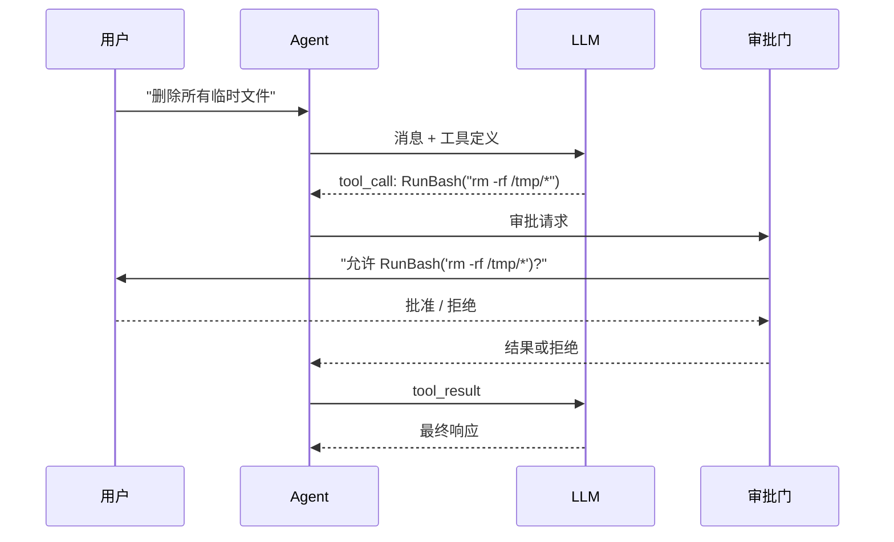

# s05: Tool Permission & Approval (工具权限与审批)

`[ s01 ] [ s02 ] [ s03 ] [ s04 ] [ s05 ] s06 | s07 > s08 > s09 > s10 > s11 > s12`

> *不是所有工具都应该直接执行。*
>
> **安全层**: `ApprovalRequiredAIFunction` -- 在危险工具前加人工审批门。

## 问题

有 shell 访问或文件写入能力的 Agent, 如果 LLM 产生了幻觉, 可能执行破坏性命令。你需要一个人工审批门来保护敏感操作。

## 解决方案



## 工作原理

1. 用 `ApprovalRequiredAIFunction` 包装敏感工具:

```csharp
var tools = new List<AITool>
{
    AIFunctionFactory.Create(GetWeather),           // 安全 -- 无需审批
    new ApprovalRequiredAIFunction(                  // 需审批
        AIFunctionFactory.Create(RunBash)),
};
```

2. 框架拦截工具调用并发出 `ToolApprovalRequestContent`:

```csharp
// 当 LLM 调用 RunBash 时, 框架暂停并请求审批.
// 审批流程由 Agent 框架自动处理.
```

3. 用 `FunctionInvokingChatClient` 构建管道:

```csharp
var client = new FunctionInvokingChatClient(baseClient);
var agent = new ChatClientAgent(client,
    instructions: "使用工具. 部分工具需要审批.",
    tools: tools);
```

4. 安全工具立即执行; 需审批的工具等待批准。

## 关键 API

| API | 用途 |
|-----|------|
| `ApprovalRequiredAIFunction` | 包装 `AITool`, 要求人工审批 |
| `ToolApprovalRequestContent` | 需要审批时发出的内容类型 |
| `AITool` | 被包装的底层工具 |
| `FunctionInvokingChatClient` | 通过审批流调度工具调用 |

## 试一试

```sh
dotnet run --project s05_permission
```

试试这些 prompt:
1. `What's the weather?` (无需审批)
2. `Run the command: ls -la` (触发审批)
3. `Delete all files in /tmp` (触发审批 -- 拒绝它!)
