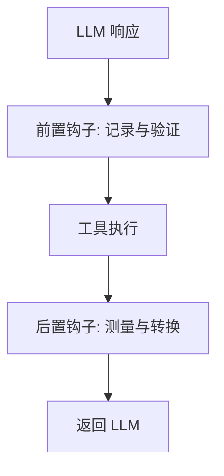

# s06: Pre/Post Tool Hooks (工具前后钩子)

`[ s01 ] [ s02 ] [ s03 ] [ s04 ] [ s05 ] [ s06 ] | s07 > s08 > s09 > s10 > s11 > s12`

> *观察和修改工具行为, 不改工具代码。*
>
> **可观测层**: `DelegatingChatClient` 中间件用于工具生命周期事件。

## 问题

你需要记录每次工具调用、测量执行时间、验证输入或转换输出 -- 但不想修改每个工具的源代码。

## 解决方案



使用 `DelegatingChatClient` 中间件拦截完整的请求/响应周期, 包括 `FunctionInvokingChatClient` 处理的工具调用。

## 工作原理

1. 创建审计中间件, 包装 `GetResponseAsync`:

```csharp
sealed class AuditMiddleware(IChatClient inner) : DelegatingChatClient(inner)
{
    public override async Task<ChatResponse> GetResponseAsync(
        IEnumerable<ChatMessage> messages, ChatOptions? options = null,
        CancellationToken ct = default)
    {
        var lastUser = messages.LastOrDefault(m => m.Role == ChatRole.User)?.Text ?? "";
        Console.WriteLine($"[AUDIT] → {lastUser[..Math.Min(60, lastUser.Length)]}");

        var sw = Stopwatch.StartNew();
        var response = await base.GetResponseAsync(messages, options, ct);
        sw.Stop();

        Console.WriteLine($"[AUDIT] ← {response.Text?.Length} 字符, 耗时 {sw.ElapsedMilliseconds}ms");
        return response;
    }
}
```

2. 在管道中插入中间件 (在 `FunctionInvokingChatClient` 外侧):

```csharp
var client = baseClient
    .AsBuilder()
    .Use(inner => new AuditMiddleware(inner))
    .UseFunctionInvocation()
    .Build();
```

3. 每次调用 -- 包括工具触发的重提示循环 -- 都经过钩子。

## 关键 API

| API | 用途 |
|-----|------|
| `DelegatingChatClient` | 拦截中间件的基类 |
| `.Use(inner => new Hook(inner))` | 注册中间件到管道 |
| `messages.LastOrDefault(m => m.Role == ChatRole.User)` | 检查对话内容 |
| `response.FinishReason` | 检查 LLM 是停止还是调用了工具 |
| `Stopwatch` | 测量工具/LLM 执行时间 |

## 试一试

```sh
dotnet run --project s06_hooks
```

试试这些 prompt:
1. `What is 2+2?` (观察审计日志)
2. `What's the weather in London?` (观察工具调用日志)
