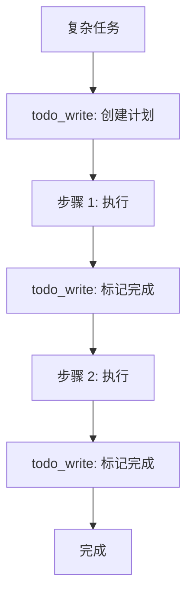

# s07: Agent Planning with TodoWrite (Agent 规划)

`[ s01 ] s02 > s03 > s04 > s05 > s06 | [ s07 ] s08 > s09 > s10 > s11 > s12`

> *把复杂任务拆解为可追踪的步骤。*
>
> **规划层**: 自定义 `todo_write` 工具, 实现有状态的任务追踪。

## 问题

复杂任务需要多步规划。没有结构化状态, Agent 会忘记哪些完成了、哪些待处理、下一步是什么。

## 解决方案



自定义 `todo_write` 工具让 Agent 维护一个跨轮次持久化的结构化任务列表。

## 工作原理

1. 定义 todo 状态和工具:

```csharp
var todoState = new List<(string content, string status)>();

[Description("添加 todo 项")]
static string TodoWrite(
    [Description("每行一个 content|status")] string items,
    List<(string, string)> state)
{
    state.Clear();
    foreach (var line in items.Split('\n', StringSplitOptions.RemoveEmptyEntries))
    {
        var parts = line.Split('|', 2);
        state.Add((parts[0].Trim(), parts.Length > 1 ? parts[1].Trim() : "pending"));
    }
    return $"已更新: {state.Count} 项";
}
```

2. 通过 `AIFunctionFactory` 注册为工具:

```csharp
var todoTool = AIFunctionFactory.Create(
    (string items) => TodoWrite(items, todoState),
    name: "todo_write",
    description: "管理 todo 列表. 格式: 每行一个 'content|status'.");
tools.Add(todoTool);
```

3. Agent 使用 `todo_write` 来规划和追踪进度:

```
User: "重构 auth 模块并加测试"
Agent 调用: todo_write("重构 auth 服务|pending\n写单元测试|pending\n运行测试|pending")
Agent 调用: todo_write("重构 auth 服务|done\n写单元测试|pending\n运行测试|pending")
```

## 关键 API

| API | 用途 |
|-----|------|
| `AIFunctionFactory.Create()` | 注册 todo 工具 |
| `todo_write` | LLM 调用的自定义工具名 |
| 闭包捕获 | 在工具和主代码间共享 `todoState` |
| `[Description]` | 告诉 LLM 期望的格式 |

## 试一试

```sh
dotnet run --project s07_planning
```

试试这些 prompt:
1. `Create a plan to build a hello-world web app`
2. `Mark the first task as done and add a new task for deployment`
