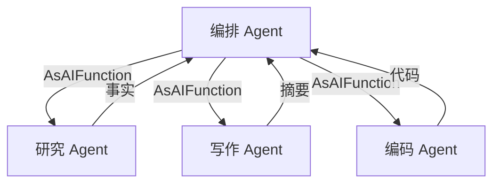

# s08: Agent as Tool (Agent 组合)

`[ s01 ] s02 > s03 > s04 > s05 > s06 | s07 > [ s08 ] s09 > s10 > s11 > s12`

> *专家 Agent 作为编排 Agent 的可调用工具。*
>
> **组合层**: `AIAgent.AsAIFunction()` -- 将子任务委托给专家 Agent。

## 问题

一个什么都想做的 Agent 会变成"样样通, 样样松"。你需要专门的研究、写作、编码 Agent, 由一个编排者协调。

## 解决方案



每个专家都是一个完整的 `AIAgent`, 通过 `.AsAIFunction()` 暴露为单个工具。

## 工作原理

1. 创建专家 Agent:

```csharp
AIAgent researcher = client.AsAIAgent(
    instructions: "简洁地研究主题. 只返回关键事实.",
    name: "Researcher",
    description: "研究主题并返回事实");

AIAgent writer = client.AsAIAgent(
    instructions: "根据研究笔记写清晰的摘要.",
    name: "Writer",
    description: "根据笔记写摘要");
```

2. 暴露为工具:

```csharp
var tools = new List<AITool>
{
    researcher.AsAIFunction(),
    writer.AsAIFunction(),
};
```

3. 创建带专家工具的编排 Agent:

```csharp
var orchestrator = new ChatClientAgent(client,
    instructions: "把研究委托给 Researcher, 写作委托给 Writer.",
    name: "Orchestrator",
    tools: tools);
```

4. 编排者决定何时调用哪个专家:

```csharp
var result = await orchestrator.RunAsync("研究量子计算并写一个摘要.");
// 编排者先调用 Researcher, 再调用 Writer, 最后合成最终答案
```

## 关键 API

| API | 用途 |
|-----|------|
| `AIAgent.AsAIFunction()` | 将 Agent 包装为可调用工具 |
| `ChatClientAgent` | 创建有特定指令的 Agent |
| `instructions` | 定义专家的角色和行为 |
| `description` | 告诉编排者何时使用此工具 |

## 试一试

```sh
dotnet run --project s08_agent_as_tool
```

试试这些 prompt:
1. `Research the history of C# and write a one-paragraph summary`
2. `What are the top 3 web frameworks? Research and compare them.`
