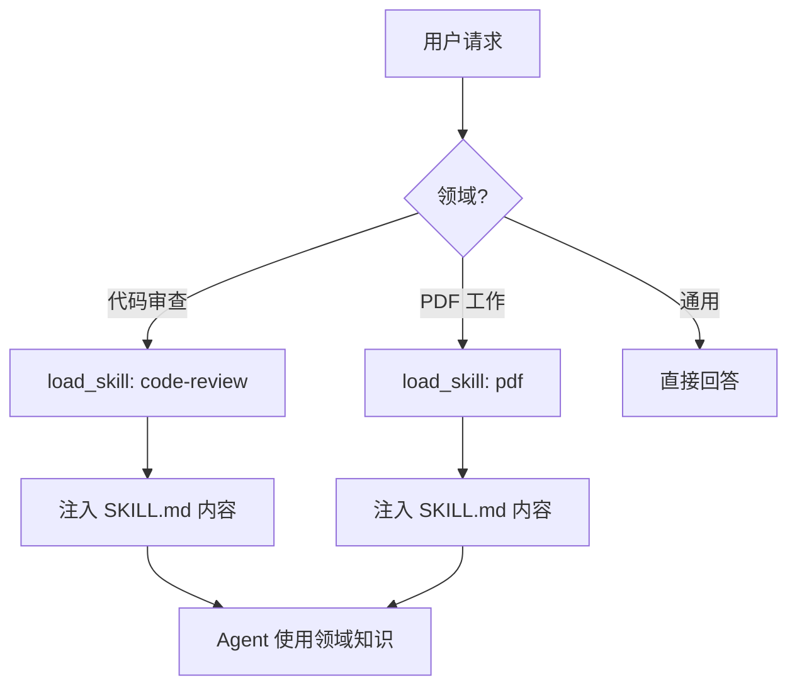

# s09: Skill Loading (技能加载)

`[ s01 ] s02 > s03 > s04 > s05 > s06 | s07 > s08 > [ s09 ] s10 > s11 > s12`

> *领域专业知识, 按需加载。*
>
> **知识层**: `SKILL.md` 目录 + `load_skill` 工具, 按需加载专业指令。

## 问题

系统提示无法包含每个可能领域的指令。你需要一种方式, 只在需要时注入专业知识 (代码审查规则、PDF 生成步骤、MCP 模式)。

## 解决方案



技能是 `skills/` 目录中的 Markdown 文件, 带 YAML frontmatter。`load_skill` 工具按需读取。

## 工作原理

1. 技能文件结构:

```markdown
---
name: code-review
description: 代码审查清单和模式
---
# Code Review Skill
## Checklist
- [ ] 命名规范
- [ ] 错误处理
...
```

2. 从文件系统构建技能目录:

```csharp
var skillsDir = Path.GetFullPath("skills");
var skillCatalog = new Dictionary<string, string>();
foreach (var dir in Directory.GetDirectories(skillsDir))
{
    var skillFile = Path.Combine(dir, "SKILL.md");
    if (File.Exists(skillFile))
        skillCatalog[Path.GetFileName(dir)] = skillFile;
}
```

3. 注册 `load_skill` 工具:

```csharp
var loadSkill = AIFunctionFactory.Create(
    (string name) =>
    {
        if (skillCatalog.TryGetValue(name, out var path))
            return File.ReadAllText(path);
        return $"技能 '{name}' 未找到. 可用: {string.Join(", ", skillCatalog.Keys)}";
    },
    name: "load_skill",
    description: "按名称加载技能以获取详细指令.");
```

4. 两级加载: Agent 先列出目录, 再按需加载详情。

## 关键 API

| API | 用途 |
|-----|------|
| `SKILL.md` | 带 YAML frontmatter 的 Markdown 技能定义 |
| `load_skill` | 加载技能内容的自定义工具 |
| `AIFunctionFactory.Create()` | 将加载器注册为工具 |
| `skills/` 目录 | 技能目录位置 |

## 试一试

```sh
dotnet run --project s09_skill_loading
```

试试这些 prompt:
1. `Load the code-review skill and review this function: int Add(int a, int b) => a + b;`
2. `What skills are available?` (列出目录)
