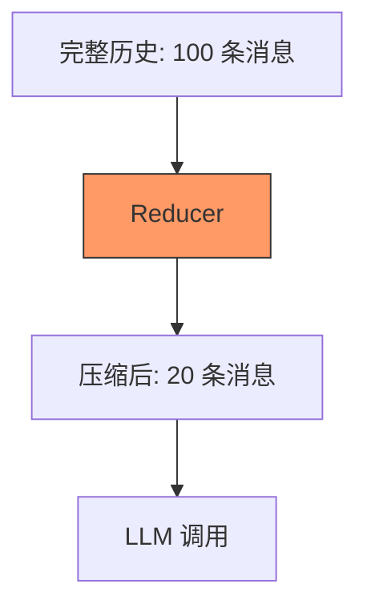

# s10: Context Compaction (上下文压缩)

`[ s01 ] s02 > s03 > s04 > s05 > s06 | s07 > s08 > s09 > [ s10 ] s11 > s12`

> *让对话保持在 token 限制内。*
>
> **记忆层**: `MessageCountingChatReducer` + `SummarizingChatReducer` 自动管理历史。

## 问题

长对话会超出模型的上下文窗口。消息被截断或调用直接失败。你需要自动的历史管理。

## 解决方案



Reducer 位于中间件管道中, 在消息到达 LLM 之前自动修剪或总结历史。

## 工作原理

1. 消息计数 Reducer -- 保留最近 N 条消息:

```csharp
var client = baseClient
    .AsBuilder()
    .UseChatReducer(new MessageCountingChatReducer(50))
    .UseFunctionInvocation()
    .Build();
```

2. 总结型 Reducer -- 用摘要替换旧消息:

```csharp
var client = baseClient
    .AsBuilder()
    .UseChatReducer(new SummarizingChatReducer(innerClient, maxMessages: 30))
    .UseFunctionInvocation()
    .Build();
```

3. Reducer 在每次 LLM 调用前自动运行:

```
第 1 轮: [msg1] → LLM
第 5 轮: [msg1..msg5] → LLM
第 50 轮: [msg1..msg50] → Reducer → [摘要 + msg41..msg50] → LLM
```

4. 与其他中间件组合:

```csharp
var client = baseClient.AsBuilder()
    .Use(inner => new AuditMiddleware(inner))
    .UseChatReducer(new MessageCountingChatReducer(50))
    .UseFunctionInvocation()
    .Build();
```

## 关键 API

| API | 用途 |
|-----|------|
| `MessageCountingChatReducer` | 保留最近 N 条消息, 丢弃更早的 |
| `SummarizingChatReducer` | 用 LLM 总结旧消息 |
| `.UseChatReducer()` | 向管道添加 Reducer 的扩展方法 |
| `DelegatingChatClient` | Reducer 底层也是中间件 |

## 试一试

```sh
dotnet run --project s10_context_compaction
```

试试这些 prompt:
1. 进行长对话 (10+ 轮), 观察日志中的压缩
2. 让 Agent 回忆对话早期的内容
