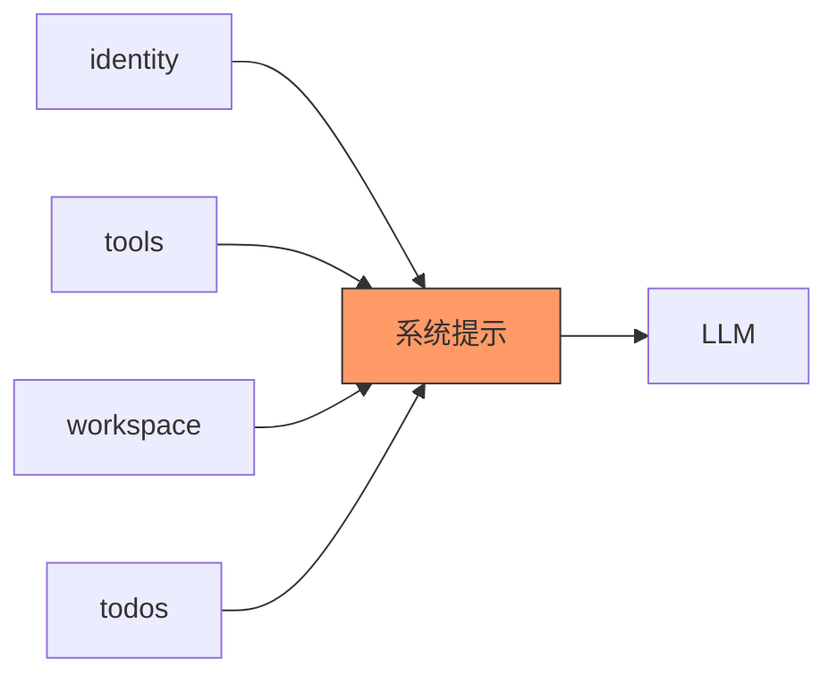

# s11: Dynamic System Prompt (动态系统提示)

`[ s01 ] s02 > s03 > s04 > s05 > s06 | s07 > s08 > s09 > s10 > [ s11 ] s12`

> *从模块化片段组装系统提示。*
>
> **提示层**: 分段键控的片段, 带缓存高效组装。

## 问题

系统提示需要包含动态上下文: 可用工具、当前目录、活跃 todo、用户偏好。把所有内容硬编码到一个字符串中既脆弱又浪费。

## 解决方案



从命名段构建系统提示。缓存它, 只在上下文变化时失效。

## 工作原理

1. 在字典中定义段:

```csharp
var sections = new Dictionary<string, string>
{
    ["identity"] = "你是一个全面的编码助手.",
    ["tools"] = $"可用工具: {string.Join(", ", tools.Select(t => t.Name))}",
    ["workspace"] = $"工作目录: {Directory.GetCurrentDirectory()}",
};
```

2. 添加动态段 (如 todo 状态):

```csharp
string? cachedPrompt = null;
string GetPrompt()
{
    if (cachedPrompt is not null) return cachedPrompt;
    cachedPrompt = string.Join("\n\n", sections.Values);
    if (todoState.Count > 0)
        cachedPrompt += "\n\n当前 todos:\n" + string.Join("\n",
            todoState.Select(t => $"- [{t.status}] {t.content}"));
    return cachedPrompt;
}
```

3. 上下文变化时使缓存失效:

```csharp
// 修改 todo 后:
cachedPrompt = null;  // 强制下次调用重建
```

4. 在 Agent 的 instructions 中使用, 或作为中间件注入的系统消息。

## 关键 API

| API | 用途 |
|-----|------|
| `Dictionary<string, string>` | 分段键控的提示片段 |
| `string.Join()` | 将段组装为完整提示 |
| 缓存模式 | 避免每次调用都重建提示 |
| `instructions` 参数 | 将组装好的提示传给 Agent |

## 试一试

```sh
dotnet run --project s11_system_prompt
```

试试这些 prompt:
1. `What tools do you have?` (测试工具段)
2. `What directory are you in?` (测试工作目录段)
3. `Add a todo: fix the login bug` (测试动态段更新)
