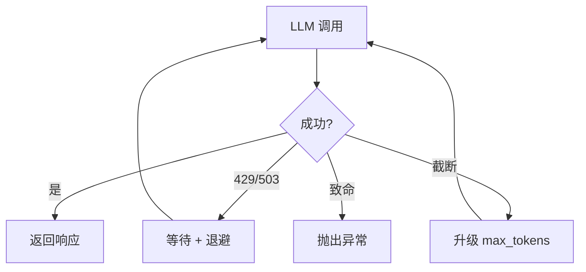

# s12: Error Recovery & Retry (错误恢复与重试)

`[ s01 ] s02 > s03 > s04 > s05 > s06 | s07 > s08 > s09 > s10 > s11 > [ s12 ]`

> *优雅处理瞬态故障。*
>
> **韧性层**: 带指数退避和 token 升级的重试中间件。

## 问题

LLM API 会返回 429 (速率限制)、503 (过载), 或响应被截断 (`FinishReason == Length`)。没有重试逻辑, 这些瞬态错误会崩溃你的 Agent。

## 解决方案



## 工作原理

1. 带指数退避的重试中间件:

```csharp
sealed class RetryMiddleware(IChatClient inner) : DelegatingChatClient(inner)
{
    public int MaxRetries { get; set; } = 3;
    public int BaseDelayMs { get; set; } = 500;

    public override async Task<ChatResponse> GetResponseAsync(
        IEnumerable<ChatMessage> messages, ChatOptions? options = null,
        CancellationToken ct = default)
    {
        for (int attempt = 0; attempt < MaxRetries; attempt++)
        {
            try
            {
                var response = await base.GetResponseAsync(messages, options, ct);
                if (response.FinishReason == ChatFinishReason.Length && MaxTokens < 32768)
                {
                    MaxTokens = Math.Min(MaxTokens * 4, 32768);
                    options = options?.Clone() ?? new ChatOptions();
                    options.MaxOutputTokens = MaxTokens;
                    return await base.GetResponseAsync(messages, options, ct);
                }
                return response;
            }
            catch (Exception ex) when (IsTransient(ex))
            {
                var delay = BaseDelayMs * Math.Pow(2, attempt) + Random.Shared.Next(0, 250);
                await Task.Delay((int)delay, ct);
            }
        }
        throw new Exception("超过最大重试次数");
    }

    static bool IsTransient(Exception ex) =>
        ex.Message.Contains("429") || ex.Message.Contains("529") || ex.Message.Contains("503");
}
```

2. 插入管道:

```csharp
var client = baseClient.AsBuilder()
    .Use(inner => new RetryMiddleware(inner))
    .UseFunctionInvocation()
    .Build();
```

## 关键 API

| API | 用途 |
|-----|------|
| `DelegatingChatClient` | 重试中间件的基类 |
| `ChatFinishReason.Length` | 检测截断的响应 |
| `options.MaxOutputTokens` | 截断时升级 token 限制 |
| `Task.Delay()` + 指数退避 | 速率限制恢复 |
| `IsTransient()` | 分类可重试的错误 |

## 试一试

```sh
dotnet run --project s12_error_recovery
```

试试这些 prompt:
1. `Write a very long essay about .NET history` (可能触发 token 升级)
2. 正常查询 (如果被限流, 观察重试行为)
