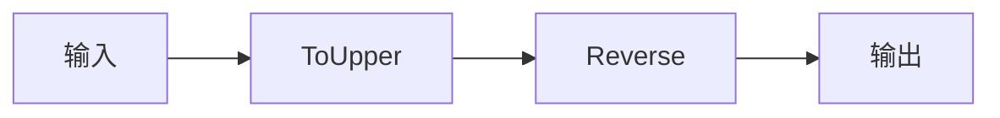

# s13: Workflows (工作流)

`[ s01 ] s02 > s03 > s04 > s05 > s06 | s07 > s08 > s09 > s10 > s11 > s12 | [ s13 ] s14 > s15 > s16 > s17`

> *把多步数据流编排为图。*
>
> **工作流层**: `WorkflowBuilder` -- 定义执行器、边和条件路由。

## 问题

有些任务不是简单的 prompt-response。你需要数据管道: 转换 → 验证 → 存储 → 通知。把这些硬编码为顺序函数调用会失去灵活性。

## 解决方案



`WorkflowBuilder` 让你定义由边连接的执行器有向图。

## 工作原理

1. 从函数定义执行器:

```csharp
Func<string, string> toUpper = s => s.ToUpperInvariant();
var upperExecutor = toUpper.BindAsExecutor("ToUpper");
```

2. 或创建自定义执行器类:

```csharp
sealed class ReverseExecutor() : Executor<string, string>("Reverse")
{
    public override ValueTask<string> HandleAsync(
        string message, IWorkflowContext context, CancellationToken ct = default)
        => ValueTask.FromResult(string.Concat(message.Reverse()));
}
```

3. 构建工作流图:

```csharp
var workflow = new WorkflowBuilder(upperExecutor)
    .AddEdge(upperExecutor, reverse)
    .WithOutputFrom(reverse)
    .Build();
```

4. 流式执行并监听事件:

```csharp
await using var run = await InProcessExecution.RunStreamingAsync(workflow, "Hello, World!");
await foreach (var evt in run.WatchStreamAsync())
{
    if (evt is ExecutorCompletedEvent completed)
        Console.WriteLine($"{completed.ExecutorId}: {completed.Data}");
}
```

5. 扇出 -- 一个输入到多个执行器:

```csharp
var fanOut = new WorkflowBuilder(upperExecutor)
    .AddEdge(upperExecutor, lowerEx)
    .WithOutputFrom(upperExecutor, lowerEx)
    .Build();
```

## 关键 API

| API | 用途 |
|-----|------|
| `WorkflowBuilder` | 工作流图的流式构建器 |
| `.BindAsExecutor()` | 将 `Func<TIn,TOut>` 转为执行器 |
| `Executor<TIn, TOut>` | 自定义执行器基类 |
| `.AddEdge()` | 连接两个执行器 |
| `.WithOutputFrom()` | 标记终端执行器 |
| `InProcessExecution.RunStreamingAsync()` | 执行并流式输出事件 |

## 试一试

```sh
dotnet run --project s13_workflows
```

观察管道执行: `ToUpper → Reverse`, 然后 `Trim → Upper → Duplicate`, 然后扇出。
