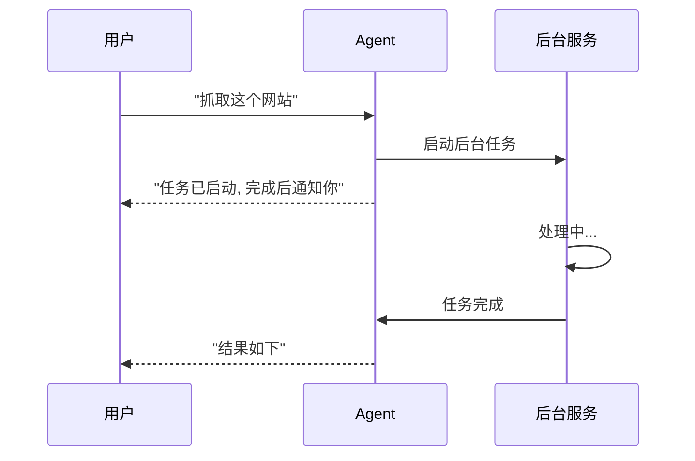

# s14: Background Tasks (后台任务)

`[ s01 ] s02 > s03 > s04 > s05 > s06 | s07 > s08 > s09 > s10 > s11 > s12 | s13 > [ s14 ] s15 > s16 > s17`

> *不阻塞 Agent 地运行长操作。*
>
> **异步层**: `BackgroundService` 用于非阻塞工具执行。

## 问题

某些工具需要几分钟 (网页抓取、大文件处理、API 轮询)。在这些操作期间阻塞 Agent 循环会浪费时间并让用户沮丧。

## 解决方案



使用 .NET 的 `BackgroundService` 模式异步运行长操作, 结果注入回对话中。

## 工作原理

1. 定义后台任务工具:

```csharp
[Description("启动一个长时间运行的后台任务")]
static string StartBackgroundTask([Description("任务描述")] string task)
{
    // 立即返回 -- 实际工作在 BackgroundService 中进行
    return $"任务 '{task}' 已启动. 完成后会通知你.";
}
```

2. 实现后台服务:

```csharp
sealed class TaskRunner : BackgroundService
{
    protected override async Task ExecuteAsync(CancellationToken ct)
    {
        while (!ct.IsCancellationRequested)
        {
            // 轮询待处理任务, 执行它们, 注入结果
            await Task.Delay(1000, ct);
        }
    }
}
```

3. 结果作为系统消息注入 Agent 的对话中。

## 关键 API

| API | 用途 |
|-----|------|
| `BackgroundService` | .NET 长时间运行后台工作的基类 |
| `ExecuteAsync()` | 后台循环 |
| `CancellationToken` | 优雅关闭支持 |
| 系统消息注入 | 将结果推回给 Agent |

## 试一试

```sh
dotnet run --project s14_background_tasks
```

试试这些 prompt:
1. `Start a background task to count to 100`
2. `What background tasks are running?`
