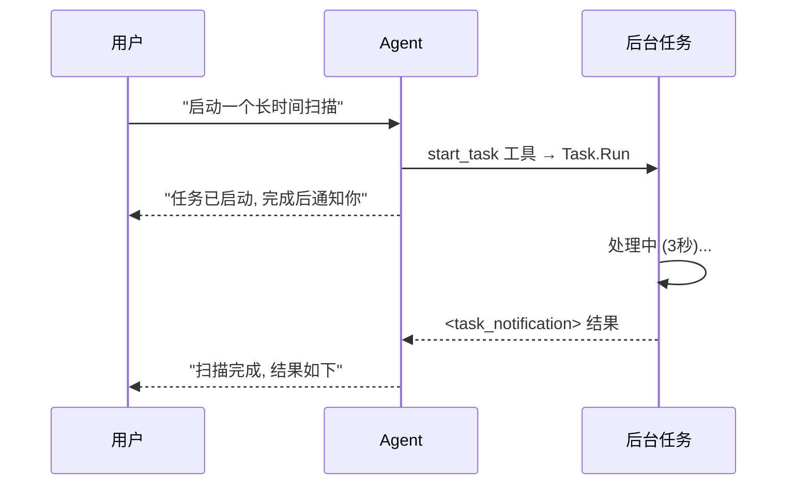

# s14: Background Tasks (后台任务)

`[ s01 ] s02 > s03 > s04 > s05 > s06 | s07 > s08 > s09 > s10 > s11 > s12 | s13 > [ s14 ] s15 > s16 > s17`

> *不阻塞 Agent 地运行长操作。*
>
> **异步层**: `AIFunctionFactory` 工具 + `<task_notification>` 注入。

## 问题

某些工具需要几分钟 (网页抓取、大文件处理、API 轮询)。在这些操作期间阻塞 Agent 循环会浪费时间并让用户沮丧。

## 解决方案



注册 `AIFunctionFactory` 工具, 通过 `Task.Run` 启动后台工作并立即返回。任务完成后, 将结果作为 `<task_notification>` 用户消息注入下一轮 Agent 对话。

## 工作原理

1. 通过 `AIFunctionFactory` 定义后台任务工具:

```csharp
var backgroundTasks = new ConcurrentDictionary<string, Task<string>>();

var tools = new List<AITool>
{
    AIFunctionFactory.Create(
        (string command) => {
            var id = $"bg_{Guid.NewGuid().ToString()[..8]}";
            backgroundTasks[id] = Task.Run(async () => {
                await Task.Delay(3000);
                return $"Completed: {command}";
            });
            return $"Started background task {id}";
        },
        name: "start_task",
        description: "Start a long-running background task."),
    AIFunctionFactory.Create(
        (string taskId) => backgroundTasks.TryGetValue(taskId, out var t)
            ? (t.IsCompletedSuccessfully ? $"Done: {t.Result}" : "running")
            : "not found",
        name: "check_task",
        description: "Check task status."),
};
```

2. 创建带工具的 `ChatClientAgent`:

```csharp
var agent = new ChatClientAgent(chatClient,
    instructions: "你可以启动后台任务。任务完成后会收到 <task_notification>。",
    name: "background-agent",
    tools: tools);
```

3. 任务完成后, 将结果作为用户消息注入:

```csharp
var completed = backgroundTasks
    .Where(kv => kv.Value.IsCompletedSuccessfully)
    .Select(kv => $"<task_notification id=\"{kv.Key}\">{kv.Value.Result}</task_notification>");

var notification = new ChatMessage(ChatRole.User,
    $"{string.Join("\n", completed)}\nAll tasks complete. Summarize results.");
await agent.RunAsync(notification, session);
```

## 关键 API

| API | 用途 |
|-----|------|
| `AIFunctionFactory.Create()` | 注册后台任务工具 |
| `ChatClientAgent` | 带工具分发的 Agent |
| `ConcurrentDictionary<string, Task<T>>` | 跟踪运行中的后台工作 |
| `<task_notification>` 注入 | 将完成的结果推回 Agent 对话 |
| `AgentRunOptions.AllowBackgroundResponses` | MAF 原生后台响应 (仅 OpenAI Responses API) |

## 试一试

```sh
dotnet run --project s14_background_tasks
```

演示启动两个后台任务, 等待完成, 注入 `<task_notification>` 消息, 并让 Agent 汇总结果。
