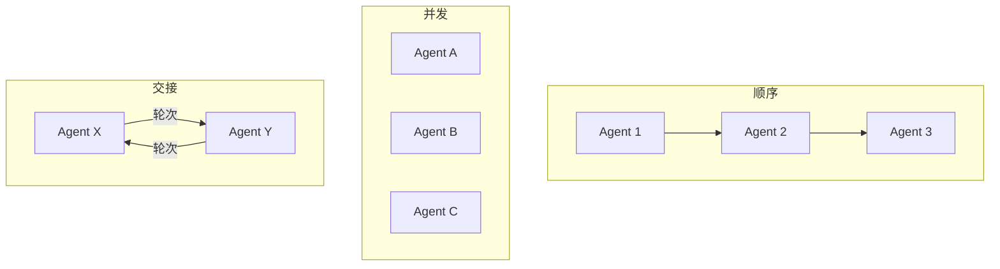

# s15: Multi-Agent Workflows (多 Agent 工作流)

`[ s01 ] s02 > s03 > s04 > s05 > s06 | s07 > s08 > s09 > s10 > s11 > s12 | s13 > s14 > [ s15 ] s16 > s17`

> *用结构化工作流协调多个 Agent。*
>
> **编排层**: `AgentWorkflowBuilder` -- 顺序、并发和交接模式。

## 问题

复杂任务需要多个 Agent 协作: 一个研究, 一个写作, 一个审查。临时协调容易出错且难以推理。

## 解决方案



`AgentWorkflowBuilder` 提供三种模式: 顺序 (管道)、并发 (扇出)、交接 (轮次委托)。

## 工作原理

1. 顺序 -- Agent 按顺序运行, 每个获得上一个的输出:

```csharp
var workflow = AgentWorkflowBuilder.BuildSequential(researcher, writer, reviewer);
```

2. 并发 -- Agent 在同一输入上并行运行:

```csharp
var workflow = AgentWorkflowBuilder.BuildConcurrent(agent1, agent2, agent3);
```

3. 交接 -- Agent 通过 `TurnToken` 互相传递控制:

```csharp
// Agent 决定交接给另一个 Agent
yield return new TurnToken(targetAgent: "Writer");
```

4. 执行工作流:

```csharp
var result = await workflow.RunAsync("研究并总结 .NET 10 特性");
```

## 关键 API

| API | 用途 |
|-----|------|
| `AgentWorkflowBuilder.BuildSequential()` | 管道: Agent 1 → Agent 2 → Agent 3 |
| `AgentWorkflowBuilder.BuildConcurrent()` | 扇出: 同一输入给所有 Agent |
| `TurnToken` | 信号, 交接控制给另一个 Agent |
| `AIAgent` | 工作流中的各个 Agent |

## 试一试

```sh
dotnet run --project s15_multi_agent_workflows
```

试试这些 prompt:
1. `Research C# 13 features and write a summary` (顺序)
2. `Compare three approaches to dependency injection` (并发)
