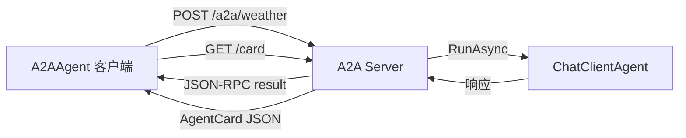

# s16: Agent-to-Agent (A2A) Protocol (Agent 间协议)

`[ s01 ] s02 > s03 > s04 > s05 > s06 | s07 > s08 > s09 > s10 > s11 > s12 | s13 > s14 > s15 > [ s16 ] s17`

> *跨服务的标准化 Agent 通信。*
>
> **协议层**: `A2AAgent`, `AgentCard`, `AddA2AServer`, `MapA2AHttpJson`。

## 问题

运行在不同服务或组织中的 Agent 需要一种标准方式来发现能力并交换消息。临时 API 会造成集成噩梦。

## 解决方案



MAF 提供专用 A2A 包: `Microsoft.Agents.AI.A2A` (客户端) 和 `Microsoft.Agents.AI.Hosting.A2A.AspNetCore` (服务端)。服务端通过 A2A HTTP+JSON 端点暴露 Agent; 客户端将远程 Agent 包装为本地 `AIAgent`。

## 工作原理

1. **服务端** — 注册 Agent 并附加 A2A server:

```csharp
builder.AddAIAgent("weather-agent",
    instructions: "You are a weather assistant.",
    chatClient: chatClient);
builder.AddA2AServer("weather-agent");
```

2. 映射 A2A HTTP+JSON 端点:

```csharp
app.MapA2AHttpJson("weather-agent", "/a2a/weather");
```

3. 定义描述 Agent 能力的 `AgentCard`:

```csharp
var card = new AgentCard
{
    Name = "WeatherAgent",
    Description = "Provides weather information",
    Version = "1.0",
    Capabilities = new A2A.AgentCapabilities { Streaming = true },
    Skills = [new A2A.AgentSkill { Id = "weather-lookup", Name = "weather-lookup",
        Description = "Get current weather", Tags = ["weather"] }],
};
```

4. **客户端** — 创建 `A2AAgent` 并像普通 `AIAgent` 一样调用:

```csharp
IA2AClient a2aClient = new A2AClient(
    new Uri("http://localhost:5161/a2a/weather"), new HttpClient());

AIAgent remoteAgent = a2aClient.AsAIAgent(
    name: "RemoteWeatherAgent",
    description: "Calls the weather agent via A2A");

var response = await remoteAgent.RunAsync("What is the weather in London?");
```

5. `A2AAgent` IS-A `AIAgent` — 可以作为工具组合、放入工作流、或用于任何 MAF 编排。

## 协议结构

```
客户端                           服务端
  │                               │
  │── GET /a2a/weather/card ────→│  (发现 AgentCard)
  │←────── AgentCard JSON ───────│
  │                               │
  │── POST /a2a/weather ────────→│  (JSON-RPC: message/send)
  │                               │  → agent.RunAsync(...)
  │←──── JSON-RPC result ────────│
  │                               │
  流式: message/stream → SSE
```

## 关键 API

| API | 包 | 用途 |
|-----|---|------|
| `A2AClient` | `A2A` | A2A 协议通信客户端 |
| `IA2AClient.AsAIAgent()` | `Microsoft.Agents.AI.A2A` | 将远程 Agent 包装为本地 `AIAgent` |
| `AgentCard` | `A2A` | 发布的元数据: 名称、能力、技能 |
| `AddA2AServer()` | `Microsoft.Agents.AI.Hosting.A2A` | 为 Agent 注册 A2A server |
| `MapA2AHttpJson()` | `Microsoft.Agents.AI.Hosting.A2A.AspNetCore` | 映射 A2A HTTP+JSON 端点 |

## 试一试

```sh
dotnet run --project s16_a2a_protocol
```

演示通过 A2A 托管一个天气 Agent, 然后通过 `A2AAgent` 客户端调用它 — 展示协议的服务端和客户端两侧。
