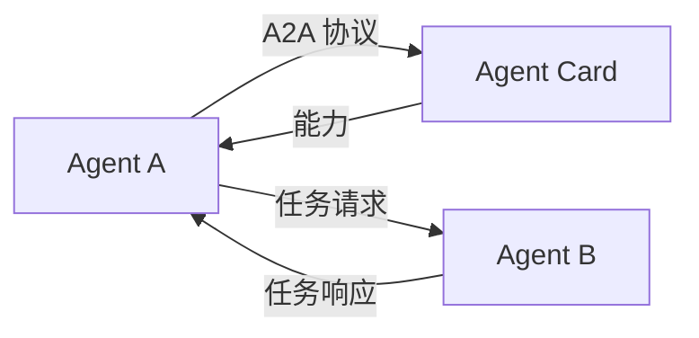

# s16: Agent-to-Agent (A2A) Protocol (Agent 间协议)

`[ s01 ] s02 > s03 > s04 > s05 > s06 | s07 > s08 > s09 > s10 > s11 > s12 | s13 > s14 > s15 > [ s16 ] s17`

> *跨服务的标准化 Agent 通信。*
>
> **协议层**: A2A `AgentCard` -- 发现和与远程 Agent 通信。

## 问题

运行在不同服务或组织中的 Agent 需要一种标准方式来发现能力并交换消息。临时 API 会造成集成噩梦。

## 解决方案



A2A 协议定义了 Agent 发现 (`AgentCard`) 和任务交换的标准。

## 工作原理

1. 定义描述你 Agent 的 `AgentCard`:

```csharp
var agentCard = new AgentCard
{
    Name = "ResearchAgent",
    Description = "研究主题并返回结构化发现",
    Url = "https://api.example.com/agents/research",
    Capabilities = new[] { "research", "summarize" }
};
```

2. Agent 通过 Card 互相发现:

```csharp
// 客户端发现远程 Agent
var remoteCard = await A2AClient.DiscoverAsync("https://api.example.com/.well-known/agent.json");
```

3. 向远程 Agent 发送任务:

```csharp
var result = await A2AClient.SendTaskAsync(remoteCard.Url, new A2ATask
{
    Message = "研究量子计算趋势"
});
```

4. 协议处理序列化、能力协商和响应路由。

## 关键 API

| API | 用途 |
|-----|------|
| `AgentCard` | 描述 Agent 的身份和能力 |
| `A2AClient.DiscoverAsync()` | 通过 well-known URL 发现远程 Agent |
| `A2AClient.SendTaskAsync()` | 向远程 Agent 发送任务 |
| A2A 协议 | 标准化的 Agent 间通信 |

## 试一试

```sh
dotnet run --project s16_a2a_protocol
```

试试这些 prompt:
1. `Discover available agents`
2. `Send a research task to the remote agent`
