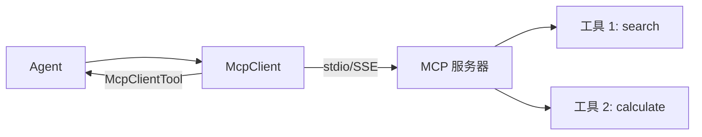

# s17: MCP Integration (MCP 集成)

`[ s01 ] s02 > s03 > s04 > s05 > s06 | s07 > s08 > s09 > s10 > s11 > s12 | s13 > s14 > s15 > s16 > [ s17 ]`

> *通过 Model Context Protocol 连接外部工具服务器。*
>
> **集成层**: `McpClient` + `McpClientTool` -- 发现和使用 MCP 服务器工具。

## 问题

你想使用外部服务器 (数据库、API、文件系统) 的工具, 而不硬编码它们的实现。每个服务器有自己的协议和工具 schema。

## 解决方案



`McpClient` 连接 MCP 服务器, 发现其工具, 返回 `McpClientTool` 实例 -- 它是 `IS-A AIFunction`, 无需转换。

## 工作原理

1. 创建带工具的内存 MCP 服务器:

```csharp
var searchTool = McpServerTool.Create(
    (string query) => $"搜索 '{query}' 的结果: 找到 3 篇文档.",
    new() { Name = "search_docs", Description = "搜索文档" });

var server = McpServer.Create(
    new StreamServerTransport(reader, writer),
    new McpServerOptions { ToolCollection = [searchTool] });
```

2. 连接客户端并发现工具:

```csharp
var mcpClient = await McpClient.CreateAsync(
    new StreamClientTransport(writer, reader));

var mcpTools = await mcpClient.ListToolsAsync();
```

3. 合并 MCP 工具和内置工具:

```csharp
var allTools = new List<AITool>(builtInTools);
foreach (var t in mcpTools) allTools.Add(t);
// McpClientTool IS-A AIFunction -- 无需转换
```

4. 用统一工具池创建 Agent:

```csharp
AIAgent agent = chatClient.AsAIAgent(
    instructions: "用 search_docs 查文档, 用 GetWeather 查天气.",
    tools: allTools);
```

## 关键 API

| API | 用途 |
|-----|------|
| `McpClient` | 连接 MCP 服务器 |
| `McpClient.ListToolsAsync()` | 发现可用工具 |
| `McpClientTool` | 工具实例 (IS-A `AIFunction`) |
| `McpServerTool.Create()` | 定义服务器端工具 |
| `McpServer` | 通过 stdio 或 SSE 传输托管工具 |

## 试一试

```sh
dotnet run --project s17_mcp_integration
```

试试这些 prompt:
1. `Search for .NET documentation` (MCP 工具)
2. `What's the weather in Tokyo?` (内置工具)
3. `Search for C# docs and tell me the weather in London` (两者)
