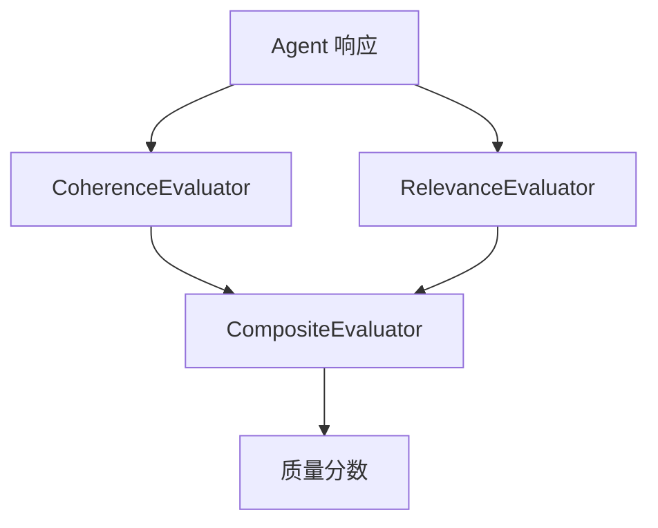

# s18: Evaluation (评估)

`[ s01 ] s02 > s03 > s04 > s05 > s06 | s07 > s08 > s09 > s10 > s11 > s12 | s13 > s14 > s15 > s16 > s17 | [ s18 ] s19 > s20`

> *自动衡量响应质量。*
>
> **质量层**: `CoherenceEvaluator`、`RelevanceEvaluator`、`CompositeEvaluator`。

## 问题

怎么知道你的 Agent 给出的答案好不好? 人工审查无法扩展。你需要自动化的响应质量评估。

## 解决方案



MEAI 提供内置评估器, 对响应的连贯性、相关性等打分。用 `CompositeEvaluator` 组合它们。

## 工作原理

1. 评估连贯性 -- 响应是否合理:

```csharp
var coherence = new CoherenceEvaluator();
var score = await coherence.EvaluateAsync(prompt, response);
Console.WriteLine($"连贯性: {score.Value}");
```

2. 评估相关性 -- 响应是否回答了问题:

```csharp
var relevance = new RelevanceEvaluator();
var score = await relevance.EvaluateAsync(prompt, response);
Console.WriteLine($"相关性: {score.Value}");
```

3. 组合评估器:

```csharp
var evaluator = new CompositeEvaluator(coherence, relevance);
var scores = await evaluator.EvaluateAsync(prompt, response);
```

4. 在 CI/CD 管道中使用, 把控 Agent 质量。

## 关键 API

| API | 用途 |
|-----|------|
| `CoherenceEvaluator` | 评估逻辑一致性 |
| `RelevanceEvaluator` | 评估主题相关性 |
| `CompositeEvaluator` | 组合多个评估器 |
| `EvaluateAsync()` | 对 prompt-response 对运行评估 |

## 试一试

```sh
dotnet run --project s18_evaluation
```

项目对示例 prompt-response 对运行评估并打印分数。
