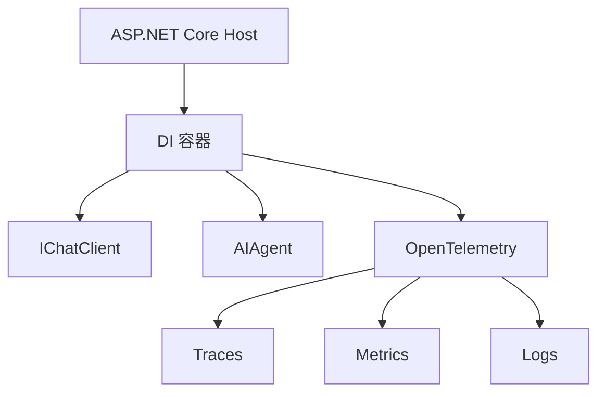

# s19: Hosting & Observability (托管与可观测性)

`[ s01 ] s02 > s03 > s04 > s05 > s06 | s07 > s08 > s09 > s10 > s11 > s12 | s13 > s14 > s15 > s16 > s17 | s18 > [ s19 ] s20`

> *把 Agent 作为服务运行, 带完整遥测。*
>
> **生产层**: ASP.NET Core 托管、`AddAIAgent()`、OpenTelemetry 追踪。

## 问题

在 `Main()` 中运行的 Agent 适合演示, 但不适合生产。你需要健康检查、结构化日志、分布式追踪和优雅关闭。

## 解决方案



在 ASP.NET Core 中托管你的 Agent, 开箱即用获得依赖注入、中间件、健康检查和 OpenTelemetry。

## 工作原理

1. 在 `Program.cs` 中注册服务:

```csharp
var builder = WebApplication.CreateBuilder(args);

// 注册 IChatClient
builder.Services.AddSingleton<IChatClient>(sp =>
    new OpenAIClient(new ApiKeyCredential(apiKey), new OpenAIClientOptions { Endpoint = new Uri(baseUrl) })
        .GetChatClient(modelId).AsIChatClient());

// 注册 Agent
builder.Services.AddAIAgent<ChatClientAgent>(options =>
{
    options.Instructions = "你是一个生产环境 Agent.";
    options.Tools = [AIFunctionFactory.Create(GetWeather)];
});

// 添加 OpenTelemetry
builder.Services.AddOpenTelemetry()
    .WithTracing(b => b.AddSource("Microsoft.Extensions.AI"))
    .WithMetrics(b => b.AddMeter("Microsoft.Extensions.AI"));
```

2. 在端点中使用 Agent:

```csharp
app.MapPost("/chat", async (AIAgent agent, string message) =>
{
    var result = await agent.RunAsync(message);
    return result.Text;
});
```

3. 健康检查和优雅关闭随 Host 免费提供。

## 关键 API

| API | 用途 |
|-----|------|
| `AddAIAgent<T>()` | 在 DI 中注册 Agent |
| `WebApplication.CreateBuilder()` | ASP.NET Core Host 构建器 |
| `AddOpenTelemetry()` | 追踪、指标、日志 |
| `IChatClient` 注册 | DI 容器中的单例 |
| `CancellationToken` | 优雅关闭传播 |

## 试一试

```sh
dotnet run --project s19_hosting_observability
```

然后:
1. `curl -X POST http://localhost:5000/chat -d "What's the weather?"`
2. 在你的收集器中检查 OpenTelemetry traces
