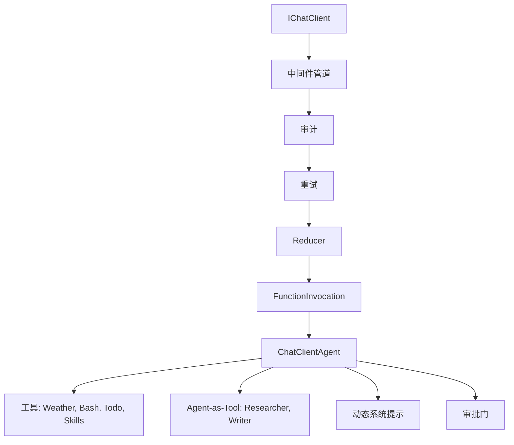

# s20: Comprehensive Capstone (综合实战)

`[ s01 ] s02 > s03 > s04 > s05 > s06 | s07 > s08 > s09 > s10 > s11 > s12 | s13 > s14 > s15 > s16 > s17 | s18 > s19 > [ s20 ]`

> *所有机制全部打通。*
>
> **综合实战**: 前 19 章的所有机制组合为一个生产级 Agent。

## 问题

每章只教一个孤立的概念。真实 Agent 需要所有机制一起工作: 中间件、工具、审批、规划、技能、组合、错误恢复和可观测性。

## 解决方案



## 工作原理

综合实战组合了:

| 特性 | 来源章节 | 实现 |
|------|---------|------|
| Provider 无关客户端 | s01 | 通过 OpenAI SDK 的 `IChatClient` |
| 中间件管道 | s02 | `AuditMiddleware`、`RetryMiddleware` |
| Agent 循环 | s03 | `ChatClientAgent` + `RunAsync` |
| 工具使用 | s04 | `AIFunctionFactory.Create()` |
| 审批门 | s05 | `ApprovalRequiredAIFunction` |
| 前后钩子 | s06 | `AuditMiddleware` 日志 |
| 规划 | s07 | `todo_write` 自定义工具 |
| Agent 组合 | s08 | `researcher.AsAIFunction()` |
| 技能加载 | s09 | `load_skill` 工具 |
| 上下文压缩 | s10 | `MessageCountingChatReducer` |
| 动态提示 | s11 | 分段键控组装 + 缓存 |
| 错误恢复 | s12 | `RetryMiddleware` 带退避 |
| 系统提示 | s11 | `GetPrompt()` 带段 |

1. 管道组装:

```csharp
var client = baseClient.AsBuilder()
    .Use(inner => new AuditMiddleware(inner))
    .Use(inner => new RetryMiddleware(inner))
    .UseChatReducer(new MessageCountingChatReducer(50))
    .UseFunctionInvocation()
    .Build();
```

2. 所有工具注册:

```csharp
var tools = new List<AITool>
{
    AIFunctionFactory.Create(GetWeather),
    new ApprovalRequiredAIFunction(AIFunctionFactory.Create(RunBash)),
    todoTool,
    loadSkill,
    researcher.AsAIFunction(),
    writer.AsAIFunction(),
};
```

3. 所有功能激活的交互式 REPL。

## 关键 API

| API | 来源 |
|-----|------|
| `IChatClient` | s01 |
| `DelegatingChatClient` | s02 |
| `ChatClientAgent` | s03 |
| `AIFunctionFactory` | s04 |
| `ApprovalRequiredAIFunction` | s05 |
| `MessageCountingChatReducer` | s10 |
| `RetryMiddleware` | s12 |

## 试一试

```sh
dotnet run --project s20_comprehensive
```

试试这些 prompt:
1. `What's the weather in Tokyo?` (工具 + 审计)
2. `Run the command: echo hello` (审批门)
3. `Plan and research .NET 10 features` (todo + agent-as-tool)
4. `Load the code-review skill` (技能加载)
